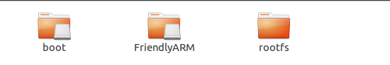
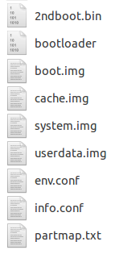
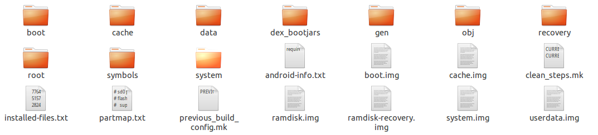
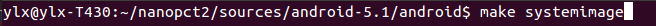

# Android 镜像编译补充说明

@(实验室工作日志)[Android, Android定制与优化, ARM, Linux]
闫隆鑫 2017/5/21
> 本手册内容为：
> 1. 对友善之臂[NanoPC-T2的使用手册](http://wiki.friendlyarm.com/wiki/index.php/NanoPC-T2/zh) 中对编译和烧写内核和Android中交代不明确的地方进行补充说明
> 2. 加入自定义Android文件系统、快速编译镜像文件的原理和步骤

------------------------------

### 1.对友善提供的img文件的说明
#### 1.1 直接从SD卡启动的img文件
- s5p4418-debian-sd4g-YYYYMMDD.img.zip 	
- s5p4418-debian-wifiap-sd4g-YYYYMMDD.img.zip 	
- s5p4418-kitkat-sd4g-YYYYMMDD.img.zip 	
- s5p4418-android-sd4g-YYYYMMDD.img.zip
- s5p4418-ubuntu-core-qte-sd4g-YYYYMMDD.img.zip
	这五个.img文件是操作系统的镜像文件，烧写到SD后，按住boot按钮开机可以从SD卡启动这个系统。但是SD卡中的系统不能固化到开发板上，拔掉SD卡就不能启动这个系统了，在实际应用中除非特殊需求，一般**没什么实际用途**，因为SD卡的可靠性一般不是太高。

#### 1.2 s5p4418-eflasher-sd8g-xxx-full.img
这个eflasher本身是一个操作系统，但它更多扮演的是一个烧写工具的作用。现对它的结构进行如下说明:

把烧写了eflasher.img镜像的SD卡插入电脑，可以看到eflasher有三个分区：
- boot分区 eflasher这个系统自己的内核和启动分区，**千万不要对它进行改动**，否则将无法进入eflasher系统，也无法实现卡刷烧写。
	- 其中，2ndboot.bin、bootloader、info.conf、env.conf、par
tmap.txt为系统引导和一些配置文件，**一般不需要用户修改**
- FriendlyArm分区 eflaher要从SD卡烧写到emmc里的系统的镜像文件，如下图! 这四个文件夹里分别为四种操作系统要用到的镜像文件，以Android5.1对应的android文件夹为例：

	- boot.img为包含了Android内核、启动过程及根目录挂载的镜像 要**修改它**需要先编译Linux内核，然后将编译好的内核镜像文件uImage放到Android源码的特定位置(device/friendly-arm/nanopi2/boot/ )，然后重新编译Android，即可获得新的boot.img。可参考[NanoPC-T2的使用手册](http://wiki.friendlyarm.com/wiki/index.php/NanoPC-T2/zh) ，如何快速编译boot.img以及修改根目录可参考后节。
	- cache.img system.img userdata.img 为Andorid系统cache、system、data等目录挂载点的镜像文件。如果要对文件目录进行修改或者单独编译可参考后节。

- rootfs 是eflasher的文件系统，一般也不需要修改。

### 2. 修改Andorid的文件系统并生成镜像
#### 2.1 Andorid启动过程
在开始之前，首先介绍一下Android启动的大致过程：
- 首先是加载内核镜像（uImage）
- 然后加载ramdisk.img镜像，并挂载到/目录下，并进行了一系列的初始化动作，包括创建各种需要的目录（/data、/cache、/system等等），初始化console，开启服务等。
- system.img、cache.img、userdata.img等镜像就是在init.rc中指定的一些脚本命令中，通过init.c进行解析并挂载到根目录下的/system、/cache、/data等目录下的。
- 而uImage和ramdisk.img在被压缩到一起，形成boot.img这一个镜像

在进行后面两节的操作前，先保证完整编译一次Andorid， 具体操作见[NanoPC-T2的使用手册](http://wiki.friendlyarm.com/wiki/index.php/NanoPC-T2/zh)
#### 2.2 修改Android根目录并快速编译boot.img

编译Android生成的所有文件系统和镜像都在 `out/target/product/nanopi2/` 这个目录下，

其依赖关系为：
- /root 文件夹生成ramdisk.img
- randisk.img和其他启动文件生成/boot/root.img.gz
- root.img.gz和其他内核文件（uImage等）组成/boot文件夹
- /boot文件夹生成boot.img /system文件夹生成system.img  /data文件夹生成userdata.img

所以要想修改Android的根目录（在进行下列操作前可以先对`out/target/product/nanopi2/`备份）
- 进入`out/target/product/nanopi2/`目录下
- 首先对/root里的内容进行修改（除非有十足的把握，在/root里只添加自己所需的，对原有的内容尽量不要更改，否则系统可能无法正常运行）
- 删除`out/target/product/nanopi2/`目录下的boot.img,ramdisk.img,ramdisk-recovery.img，以及子目录/boot下的root.img.gz以及ramdisk-recovery.img等文件
- 在命令行里，在Android源码的主目录下执行`make bootimage`
- 待编译完成后（大概10多分钟，已经比完整编译Android快三四个小时了……）,在`out/target/product/nanopi2/`生成了新的boot.img
- 复制boot.img到烧写了eflasher的SD卡的`/FriendlyArm/android`目录下替换掉原有文件即可。

#### 2.3 修改Android/system目录并快速编译system.img
步骤与上节类似，且更加简单
- 进入`out/target/product/nanopi2/`目录下
- 首先对/system里的内容进行修改（除非有十足的把握，在/system里只添加自己所需的，对原有的内容尽量不要更改，否则系统可能无法正常运行）
- 删除`out/target/product/nanopi2/`目录下的system.img
- 在命令行里，在Android源码的主目录下执行`make systemimage`
- 待编译完成后（大概30多分钟）,在`out/target/product/nanopi2/`生成了新的system.img
- 复制system.img到烧写了eflasher的SD卡的`/FriendlyArm/android`目录下替换掉原有文件即可。
