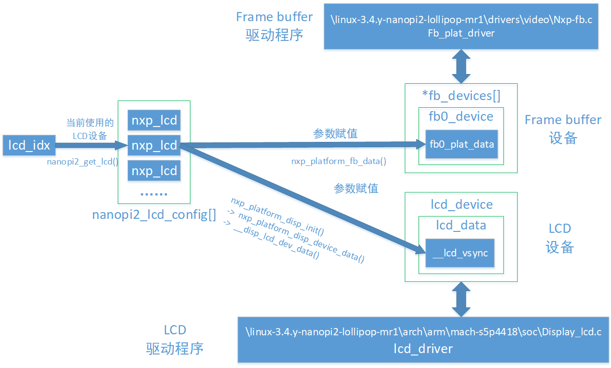
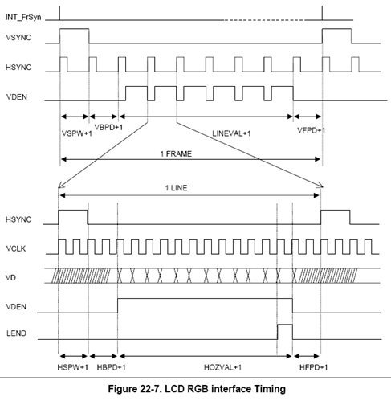
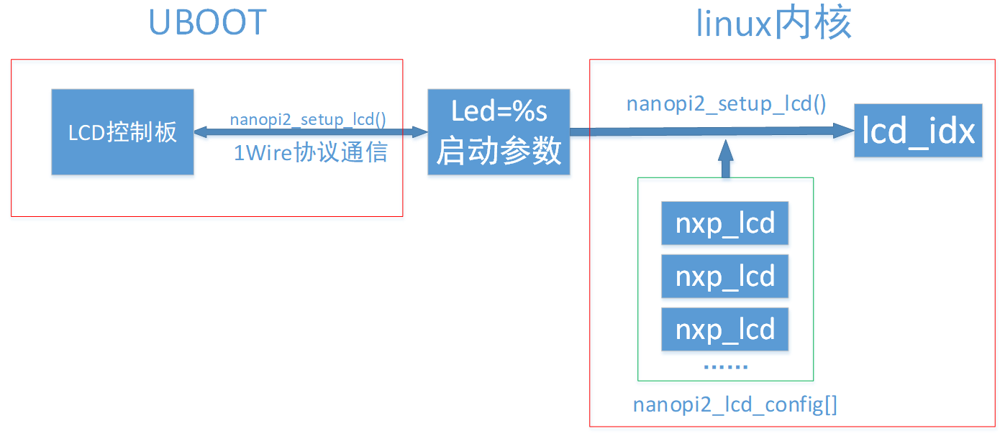
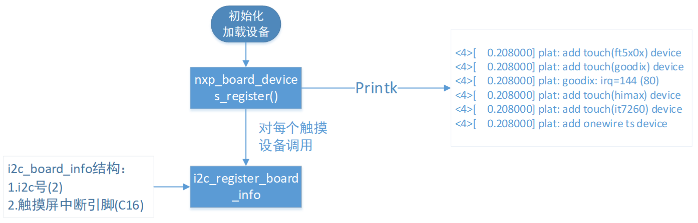
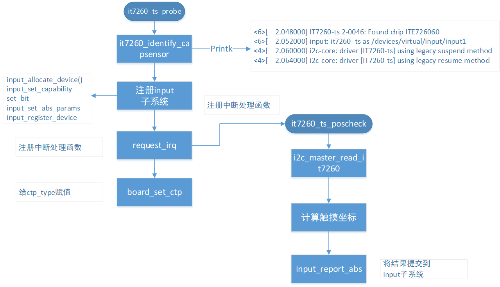
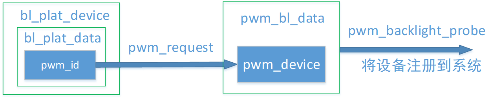

# LCD驱动源码萃取

周星宇
2018.3.22


## 1.LCD设备

### 1.0 总览

在系统开机启动LCD初始化过程中，需要经历三个过程：
1. LCD型号选择
2. 初始化LCD设备
3. 初始化frameBuffer设备



### 1.1 LCD型号

NanoPi2支持的所有LCD型号使用一个结构体来存储nanopi2_lcd_config

``` c
1.	/* Try to guess LCD panel by kernel command line, or
2.	 * using *HD101* as default  
3.	 * \linux-3.4.y-nanopi2-lollipop-mr1\arch\arm\plat-s5p4418\nanopi2
4.	*/  
5.	static struct {  
6.	    char *name;  
7.	    struct nxp_lcd *lcd;  
8.	    int ctp;  
9.	} nanopi2_lcd_config[] = {  
10.	    { "HD101",  &wxga_hd101, 1 },  
11.	    { "HD101B", &wxga_hd101, CTP_GOODIX  },  
12.	    { "HD700",  &wxga_hd700, 1 },  
13.	    { "HD702",  &wxga_hd700, CTP_GOODIX  },  
14.	    { "S70",    &wvga_s70,   1 },  
15.	    { "S702",   &wvga_s702,  1 },  
16.	    { "S70D",   &wvga_s70d,  0 },  
17.	    { "X710",   &wsvga_x710, CTP_ITE7260 },   
18.	    { "S430",   &wvga_s430,  CTP_HIMAX   },  
19.	#ifndef CONFIG_ANDROID  
20.	    { "H43",    &hvga_h43,   0 },  
21.	    { "P43",    &hvga_p43,   0 },  
22.	    { "W35",    &qvga_w35,   0 },  
23.	#endif  
24.	    /* TODO: Testing */  
25.	    { "W50",    &wvga_w50,   0 },  
26.	    { "W101",   &wsvga_w101, 1 },  
27.	    { "A97",    &xga_a97,    0 },  
28.	    { "LQ150",  &xga_lq150,  1 },  
29.	    { "L80",    &vga_l80,    1 },  
30.	    { "BP101",  &wxga_bp101, 1 },  
31.	    { "HDMI",   &hdmi_def,   0 },   /* Pls keep it at last */  
32.	};  
```

其中存储了每种LCD的名称与驱动参数。
第一列：LCD名字
第二列：LCD参数结构体
第三列：使用触摸芯片型号
下面用wsvga_x710型号的LCD举例。

``` c
1.	/*  
2.	 * \linux-3.4.y-nanopi2-lollipop-mr1\arch\arm\plat-s5p4418\nanopi2
3.	 */  
4.	static struct nxp_lcd wsvga_x710 = {  
5.	    .width= 1024,  
6.	    .height = 600,  
7.	    .p_width = 154,  
8.	    .p_height = 90,  
9.	    .bpp = 24,  
10.	    .freq = 61,  
11.	    .timing = {  
12.	        .h_fp = 84,  
13.	        .h_bp = 84,  
14.	        .h_sw = 88,  
15.	        .v_fp = 10,  
16.	        .v_fpe = 1,  
17.	        .v_bp = 10,  
18.	        .v_bpe = 1,  
19.	        .v_sw = 20,  
20.	    },  
21.	    .polarity = {  
22.	        .rise_vclk = 0,  
23.	        .inv_hsync = 1,  
24.	        .inv_vsync = 1,  
25.	        .inv_vden = 0,  
26.	    },  
27.	    .gpio_init = hd101_gpio_init,  
28.	};  

```
其中各参数的含义如下：

``` c
1.	/*
2.	 * \linux-3.4.y-nanopi2-lollipop-mr1\arch\arm\plat-s5p4418\nanopi2\include
3.	 * struct nxp_lcd
4.	 * @width:      horizontal resolution <水平分辨率>
5.	 * @height:     vertical resolution <垂直分辨率>
6.	 * @p_width:    width of lcd in mm <水平物理尺寸>
7.	 * @p_height:   height of lcd in mm <垂直物理尺寸>
8.	 * @bpp:        bits per pixel <每个像素要用多少位(24)>
9.	 * @freq:       vframe frequency <刷新帧率(61)>
10.	 * @timing:     timing values <存储时序参数的结构体>
11.	 * @polarity:   polarity settings <结构体，存储信号线极性>
12.	 * @gpio_init:  pointer to GPIO init function <GPIO初始化函数>
13.	 *
14.	 */  
15.	struct nxp_lcd {  
16.	    int width;  
17.	    int height;  
18.	    int p_width;  
19.	    int p_height;  
20.	    int bpp;  
21.	    int freq;  
22.	    struct  nxp_lcd_timing timing;  
23.	    struct  nxp_lcd_polarity polarity;  
24.	    void    (*gpio_init)(void);  
25.	};  

```

``` c
1.	/*
2.	 * struct nxp_lcd_timing
3.	 * @h_fp:   horizontal front porch
4.	 * @h_bp:   horizontal back porch
5.	 * @h_sw:   horizontal sync width
6.	 * @v_fp:   vertical front porch
7.	 * @v_fpe:  vertical front porch for even field
8.	 * @v_bp:   vertical back porch
9.	 * @v_bpe:  vertical back porch for even field
10.	 */  
11.	struct nxp_lcd_timing {  
12.	    int h_fp;  
13.	    int h_bp;  
14.	    int h_sw;  
15.	    int v_fp;  
16.	    int v_fpe;  
17.	    int v_bp;  
18.	    int v_bpe;  
19.	    int v_sw;  
20.	};  

```

时序参数的含义参考LCD控制时序




``` c
1.	/*
2.	 * struct nxp_lcd_polarity
3.	 * @rise_vclk:  if 1, video data is fetched at rising edge
4.	 * @inv_hsync:  if HSYNC polarity is inversed
5.	 * @inv_vsync:  if VSYNC polarity is inversed
6.	 * @inv_vden:   if VDEN polarity is inversed
7.	 */  
8.	struct nxp_lcd_polarity {  
9.	    int rise_vclk;  
10.	    int inv_hsync;  
11.	    int inv_vsync;  
12.	    int inv_vden;  
13.	};

```

这些LCD参数在系统的配置过程中有两个去向，分别用来初始化两个platform设备：
1. LCD 的vsync参数->LCD设备
2. Framebuffer参数->framebuffer设备

### 1.2 lcd设备初始化

LCD设备使用platform设备驱动框架，由一个platform_device结构体来描述。

该设备对应的驱动程序用来控制s5p4418芯片中LCD控制器，从而实现对LCD液晶屏显示的控制。

``` c
1.	//linux-3.4.y-nanopi2-lollipop-mr1\arch\arm\mach-s5p4418\dev-display.c  
2.	static struct disp_lcd_param   __lcd_devpar;  
3.	  
4.	static struct nxp_lcd_plat_data lcd_data = {  
5.	    .display_in     = DISPLAY_INPUT(CONFIG_NXP_DISPLAY_LCD_IN),  
6.	    .display_dev    = DISP_DEVICE_LCD,  
7.	    .vsync          = &__lcd_vsync,  
8.	    .dev_param      = (union disp_dev_param*)&__lcd_devpar,  
9.	};  
10.	//LCD设备  
11.	static struct platform_device lcd_device = {  
12.	    .name   = DEV_NAME_LCD,  
13.	    .id     = -1,  
14.	    .dev    = {  
15.	        .platform_data  = &lcd_data  
16.	    },  
17.	};  

```

其中lcd_data中的vsync成员中存储了LCD控制时序相关的参数

``` c
1.	static struct disp_vsync_info __lcd_vsync = {  
2.	    /* default parameters refer to cfg_main.h */  
3.	    #if defined(CFG_DISP_PRI_RESOL_WIDTH) && defined(CFG_DISP_PRI_RESOL_HEIGHT)  
4.	    .h_active_len   = CFG_DISP_PRI_RESOL_WIDTH,  
5.	    .h_sync_width   = CFG_DISP_PRI_HSYNC_SYNC_WIDTH,  
6.	    .h_back_porch   = CFG_DISP_PRI_HSYNC_BACK_PORCH,  
7.	    .h_front_porch  = CFG_DISP_PRI_HSYNC_FRONT_PORCH,  
8.	    .h_sync_invert  = CFG_DISP_PRI_HSYNC_ACTIVE_HIGH,  
9.	    .v_active_len   = CFG_DISP_PRI_RESOL_HEIGHT,  
10.	    .v_sync_width   = CFG_DISP_PRI_VSYNC_SYNC_WIDTH,  
11.	    .v_back_porch   = CFG_DISP_PRI_VSYNC_BACK_PORCH,  
12.	    .v_front_porch  = CFG_DISP_PRI_VSYNC_FRONT_PORCH,  
13.	    .v_sync_invert  = CFG_DISP_PRI_VSYNC_ACTIVE_HIGH,  
14.	    .pixel_clock_hz = CFG_DISP_PRI_PIXEL_CLOCK,  
15.	    .clk_src_lv0    = CFG_DISP_PRI_CLKGEN0_SOURCE,  
16.	    .clk_div_lv0    = CFG_DISP_PRI_CLKGEN0_DIV,  
17.	    .clk_src_lv1    = CFG_DISP_PRI_CLKGEN1_SOURCE,  
18.	    .clk_div_lv1    = CFG_DISP_PRI_CLKGEN1_DIV,  
19.	    #endif  
20.	};  

```

其中的参数初始值的宏定义在板子相关的初始化文件cfg_main.h中：

``` c
1.	// \linux-3.4.y-nanopi2-lollipop-mr1\arch\arm\plat-s5p4418\nanopi2\include\cfg_main.h  
2.	#define CFG_DISP_PRI_RESOL_WIDTH                1280    // X Resolution  
3.	#define CFG_DISP_PRI_RESOL_HEIGHT               800 // Y Resolution  
4.	  
5.	#define CFG_DISP_PRI_HSYNC_SYNC_WIDTH           30  
6.	#define CFG_DISP_PRI_HSYNC_BACK_PORCH           16  
7.	#define CFG_DISP_PRI_HSYNC_FRONT_PORCH          16  
8.	#define CFG_DISP_PRI_HSYNC_ACTIVE_HIGH          CTRUE  
9.	#define CFG_DISP_PRI_VSYNC_SYNC_WIDTH           12  
10.	#define CFG_DISP_PRI_VSYNC_BACK_PORCH           8  
11.	#define CFG_DISP_PRI_VSYNC_FRONT_PORCH          8  
12.	#define CFG_DISP_PRI_VSYNC_ACTIVE_HIGH          CTRUE  

```

但是加载驱动时的参数值并不再是这些宏定义中的初始值，nxp_platform_disp_init函数将nanopi2_lcd_config[]中对应型号的LCD参数赋值到__lcd_vsync中。实现LCD设备参数和1.1节描述的参数同一性。

### 2.3 frameBuffer设备

``` c
1.	/*------------------------------------------------------------------------------
2.	 * \linux-3.4.y-nanopi2-lollipop-mr1\arch\arm\plat-s5p4418\nanopi2
3.	 */  
4.	static struct platform_device *fb_devices[] = {  
5.	    #if defined (CONFIG_FB0_NXP)  
6.	    &fb0_device,  
7.	    #endif  
8.	};  
9.	  
10.	/*
11.	 * \linux-3.4.y-nanopi2-lollipop-mr1\arch\arm\plat-s5p4418\nanopi2
12.	 */  
13.	#if defined (CONFIG_FB0_NXP)  
14.	static struct platform_device fb0_device = {  
15.	    .name   = DEV_NAME_FB,  
16.	    .id     = 0,    /* FB device node num */  
17.	    .dev    = {  
18.	        .coherent_dma_mask  = 0xffffffffUL, /* for DMA allocate */  
19.	        .platform_data      = &fb0_plat_data  
20.	    },  
21.	};  
22.	  
23.	static struct nxp_fb_plat_data fb0_plat_data = {  
24.	    .module         = CONFIG_FB0_NXP_DISPOUT,  
25.	    .layer          = CFG_DISP_PRI_SCREEN_LAYER,  
26.	    #ifdef CONFIG_FB_NXP_X8R8G8B8  
27.	    .format         = MLC_RGBFMT_X8R8G8B8,  
28.	    #else  
29.	    .format         = CFG_DISP_PRI_SCREEN_RGB_FORMAT,  
30.	    #endif  
31.	    .bgcolor        = CFG_DISP_PRI_BACK_GROUND_COLOR,  
32.	    .bitperpixel    = CFG_DISP_PRI_SCREEN_PIXEL_BYTE * 8,  
33.	    .x_resol        = CFG_DISP_PRI_RESOL_WIDTH,  
34.	    .y_resol        = CFG_DISP_PRI_RESOL_HEIGHT,  
35.	    #ifdef CONFIG_ANDROID  
36.	    .buffers        = 3,  
37.	    .skip_pan_vsync = 1,  
38.	    #else  
39.	    .buffers        = 2,  
40.	    #endif  
41.	    .lcd_with_mm    = CFG_DISP_PRI_LCD_WIDTH_MM,    /* 152.4 */  
42.	    .lcd_height_mm  = CFG_DISP_PRI_LCD_HEIGHT_MM,   /* 91.44 */  
43.	};  
44.	#endif  

```

其中默认值定义如下：

``` c
1.	/*
2.	 * \linux-3.4.y-nanopi2-lollipop-mr1\arch\arm\plat-s5p4418\nanopi2\include
3.	 * fb0_plat_data结构中的部分信息
4.	 */  
5.	 #define CFG_DISP_PRI_LCD_WIDTH_MM               218  
6.	#define CFG_DISP_PRI_LCD_HEIGHT_MM              136  
7.	 #define CFG_DISP_PRI_RESOL_WIDTH                1280   // X Resolution  
8.	#define CFG_DISP_PRI_RESOL_HEIGHT               800 // Y Resolution  

```

该结构也需要在初始化时期载入1.1描述的对应型号LCD参数。


### 1.4 驱动加载流程

在linux内核启动之前，uboot已经进行了LCD型号识别的工作。
uboot使用1wire通信协议和LCD控制板进行交互，读取LCD型号的信息，并将该信息以linux内核启动参数的形式传递给linux内核。
从而linux内核能在众多支持的LCD型号中选择出使用的型号。



本节描述LCD驱动加载流程中调用的各函数

``` c
1.	/*------------------------------------------------------------------------------
2.	 * \linux-3.4.y-nanopi2-lollipop-mr1\arch\arm\plat-s5p4418\nanopi2
3.	 */  
4.	#if defined(CONFIG_NXP_DISPLAY)  
5.	static void nxp_platform_disp_init(struct nxp_lcd *lcd){  
6.	    struct disp_vsync_info vsync;  
7.	    struct nxp_lcd_timing *timing;  
8.	    u32 clk = 800000000;  
9.	    u32 div;  
10.	  
11.	    if (lcd) {  
12.	        timing = &lcd->timing;  
13.	  
14.	        vsync.interlace     = 0;  
15.	        vsync.h_active_len  = lcd->width;  
16.	        vsync.h_sync_width  = timing->h_sw;  
17.	        vsync.h_back_porch  = timing->h_bp;  
18.	        vsync.h_front_porch = timing->h_fp;  
19.	        vsync.h_sync_invert = !lcd->polarity.inv_hsync;  
20.	  
21.	        vsync.v_active_len  = lcd->height;  
22.	        vsync.v_sync_width  = timing->v_sw;  
23.	        vsync.v_back_porch  = timing->v_bp;  
24.	        vsync.v_front_porch = timing->v_fp;  
25.	        vsync.v_sync_invert = !lcd->polarity.inv_vsync;  
26.	  
27.	        /* calculates pixel clock */  
28.	        div  = timing->h_sw + timing->h_bp + timing->h_fp + lcd->width;  
29.	        div *= timing->v_sw + timing->v_bp + timing->v_fp + lcd->height;  
30.	        div *= lcd->freq ? : 60;  
31.	        do_div(clk, div);  
32.	  
33.	        vsync.pixel_clock_hz= div;  
34.	        vsync.clock_gen_num = 0;  
35.	        vsync.clk_src_lv0   = CFG_DISP_PRI_CLKGEN0_SOURCE;  
36.	        vsync.clk_div_lv0   = clk;  
37.	        vsync.clk_src_lv1   = CFG_DISP_PRI_CLKGEN1_SOURCE;  
38.	        vsync.clk_div_lv1   = CFG_DISP_PRI_CLKGEN1_DIV;  
39.	        vsync.clk_out_inv   = lcd->polarity.rise_vclk;  
40.	  
41.	        if (lcd->gpio_init)  
42.	            lcd->gpio_init();  
43.	  
44.	#if defined(CONFIG_NXP_DISPLAY_LCD)  
45.	        nxp_platform_disp_device_data(DISP_DEVICE_LCD,  &vsync, NULL, NULL);  
46.	#endif  
47.	#if defined(CONFIG_NXP_DISPLAY_LVDS)  
48.	        nxp_platform_disp_device_data(DISP_DEVICE_LVDS, &vsync, NULL, NULL);  
49.	#endif  
50.	    }  
51.	}  
52.	#endif  

```

``` c
1.	/*
2.	 * \linux-3.4.y-nanopi2-lollipop-mr1\arch\arm\plat-s5p4418\nanopi2
3.	 */  
4.	static void nxp_platform_fb_data(struct nxp_lcd *lcd){  
5.	#if defined (CONFIG_FB0_NXP)  
6.	    struct nxp_fb_plat_data *pdata = &fb0_plat_data;  
7.	  
8.	    if (lcd) {  
9.	        pdata->x_resol = lcd->width;  
10.	        pdata->y_resol = lcd->height;  
11.	  
12.	#if defined (CONFIG_FB0_NXP_FIXED_DPI)  
13.	        pdata->lcd_with_mm = (lcd->width * 254) / 1310;  
14.	        pdata->lcd_height_mm = (lcd->height * 254) / 1310;  
15.	#else  
16.	        pdata->lcd_with_mm = lcd->p_width;  
17.	        pdata->lcd_height_mm = lcd->p_height;  
18.	#endif  
19.	    }  
20.	#endif  
21.	}  

```

``` c
1.	/**
2.	 * \linux-3.4.y-nanopi2-lollipop-mr1\drivers\base
3.	 * platform_add_devices - add a numbers of platform devices
4.	 * @devs: array of platform devices to add
5.	 * @num: number of platform devices in array
6.	 */  
7.	int platform_add_devices(struct platform_device **devs, int num){  
8.	    int i, ret = 0;  
9.	    for (i = 0; i < num; i++) {  
10.	        ret = platform_device_register(devs[i]);  
11.	        if (ret) {  
12.	            while (--i >= 0)  
13.	                platform_device_unregister(devs[i]);  
14.	            break;  
15.	        }  
16.	    }  
17.	    return ret;  
18.	}  

```

## 3.触摸


### 3.1 编译驱动

首先linux内核要支持对应的触摸芯片驱动。
修改.config文件，添加触摸屏驱动支持

``` c
1.	# CONFIG_TOUCHSCREEN_TOUCHIT213 is not set  
2.	# CONFIG_TOUCHSCREEN_TSC_SERIO is not set  
3.	# CONFIG_TOUCHSCREEN_TSC2005 is not set  
4.	# CONFIG_TOUCHSCREEN_TSC2007 is not set  
5.	# CONFIG_TOUCHSCREEN_ST1232 is not set  
6.	# CONFIG_TOUCHSCREEN_TPS6507X is not set  
7.	CONFIG_TOUCHSCREEN_FT5X0X=y

```

### 3.2 定义I2c设备

触摸屏相关的I2C设备在
linux-3.4.y-nanopi2-lollipop-mr1\arch\arm\plat-s5p4418\nanopi2\device.c
中定义。

``` c
1.	#if defined(CONFIG_TOUCHSCREEN_IT7260)  
2.	#define IT7260_I2C_BUS      (2)  
3.	  
4.	static struct i2c_board_info __initdata it7260_i2c_bdi = {  
5.	    I2C_BOARD_INFO("IT7260", (0x8C>>1)),  
6.	    .irq = PB_PIO_IRQ(CFG_IO_TOUCH_IRQ),  
7.	};  
8.	#endif

```

其中需要注意：
1. I2C设备的地址怎么写(例子中为0x8C>>1)
2. "IT7260"为I2C设备名称，需要和驱动IT7260设备驱动程序中的驱动名称一致。
驱动程序定义如下所示：

``` c
1.	//linux-3.4.y-nanopi2-lollipop-mr1\drivers\input\touchscreen\it7260_mts.c  
2.	static const struct i2c_device_id it7260_ts_id[] = {  
3.	    {"IT7260", 0},  
4.	    {}          /* should not omitted */  
5.	};  
6.	MODULE_DEVICE_TABLE(i2c, it7260_ts_id);  
7.	  
8.	static struct i2c_driver it7260_ts_driver = {  
9.	    .driver = {  
10.	        .name = "IT7260-ts",  
11.	    },  
12.	    .probe = it7260_ts_probe,  
13.	    .remove = __devexit_p(it7260_ts_remove),  
14.	    .suspend = it7260_ts_suspend,  
15.	    .resume = it7260_ts_resume,  
16.	    .id_table = it7260_ts_id,  
17.	};

```

### 3.3 触摸屏设备加载

加载总体流程如下图所示：



在开机初始化函数nxp_board_devices_register(void)中加载3.2中定义的触摸触摸屏设备。
注册的新触摸驱动需要在该函数中进行加载

``` c
1.	//linux-3.4.y-nanopi2-lollipop-mr1\arch\arm\plat-s5p4418\nanopi2\device.c  
2.	void __init nxp_board_devices_register(void){  
3.	//.................  
4.	#if defined(CONFIG_TOUCHSCREEN_FT5X0X)  
5.	    printk("plat: add touch(ft5x0x) device\n");  
6.	    ft5x0x_pdata.screen_max_x = lcd->width;  
7.	    ft5x0x_pdata.screen_max_y = lcd->height;  
8.	    i2c_register_board_info(FT5X0X_I2C_BUS, &ft5x0x_i2c_bdi, 1);  
9.	#endif  
10.	  
11.	#if defined(CONFIG_TOUCHSCREEN_GOODIX)  
12.	    printk("plat: add touch(goodix) device\n");  
13.	    goodix_pdata.screen_max_x = lcd->width;  
14.	    goodix_pdata.screen_max_y = lcd->height;  
15.	    i2c_register_board_info(GOODIX_I2C_BUS, &goodix_i2c_bdi, 1);  
16.	    printk("plat: goodix: irq=%d (%d)\n", PB_PIO_IRQ(CFG_IO_TOUCH_IRQ), CFG_IO_TOUCH_IRQ);  
17.	#endif  
18.	  
19.	#if defined(CONFIG_TOUCHSCREEN_HIMAX)  
20.	    printk("plat: add touch(himax) device\n");  
21.	    i2c_register_board_info(HIMAX_I2C_BUS, &himax_i2c_bdi, 1);  
22.	#endif  
23.	  
24.	#if defined(CONFIG_TOUCHSCREEN_IT7260)  
25.	    printk("plat: add touch(it7260) device\n");  
26.	    i2c_register_board_info(IT7260_I2C_BUS, &it7260_i2c_bdi, 1);  
27.	#endif  
28.	//.......................

```

如果系统中已经内置了对应型号的驱动，且驱动名称和设备名称一致。Probe函数就会被调用。Probe函数中进行一些工作：
注册input子系统
注册中断处理函数。。。。等等。
如下图所示：



### 3.4 触摸驱动型号确认

触摸芯片型号和LCD型号相关联

``` c
1.	//linux-3.4.y-nanopi2-lollipop-mr1\arch\arm\plat-s5p4418\nanopi2\lcds.c  
2.	static int __init nanopi2_init_ctp(char *str)  
3.	{  
4.	    unsigned int val;  
5.	    char *p = str, *end;  
6.	  
7.	    val = simple_strtoul(p, &end, 10);  
8.	    if (end <= p) {  
9.	        return 1;  
10.	    }  
11.	  
12.	    if (val < CTP_MAX && nanopi2_lcd_config[lcd_idx].ctp) {  
13.	        ctp_type = val;  
14.	    } else if (val == CTP_NONE) {  
15.	        ctp_type = CTP_NONE;  
16.	    }  
17.	  
18.	    return 1;  
19.	}  
20.	__setup("ctp=", nanopi2_init_ctp);  
21.	  
22.	unsigned int nanopi2_get_ctp(void)  
23.	{  
24.	    if (nanopi2_lcd_config[lcd_idx].ctp)  
25.	        return ctp_type;  
26.	    else  
27.	        return CTP_NONE;  
28.	}  
29.	EXPORT_SYMBOL(nanopi2_get_ctp);  
30.	  
31.	void nanopi2_set_ctp(int type)  
32.	{  
33.	    if (ctp_type == CTP_AUTO && type < CTP_MAX) {  
34.	        ctp_type = type;  
35.	    }  
36.	}  
37.	EXPORT_SYMBOL(nanopi2_set_ctp);

```

``` c
1.	static inline int board_get_ctp(void) {  
2.	    return nanopi2_get_ctp();  
3.	}  

```

## 3.背光驱动




``` c
1.	//linux-3.4.y-nanopi2-lollipop-mr1\arch\arm\plat-s5p4418\nanopi2\device.c  
2.	#if defined(CONFIG_BACKLIGHT_PWM)  
3.	#include <linux/pwm_backlight.h>  
4.	  
5.	static struct platform_pwm_backlight_data bl_plat_data = {  
6.	    .pwm_id         = CFG_LCD_PRI_PWM_CH,  
7.	    .max_brightness = 400,  /* 255 is 100%, set over 100% */  
8.	    .dft_brightness = 128,  /* 50% */  
9.	    .pwm_period_ns  = 1000000000/CFG_LCD_PRI_PWM_FREQ,  
10.	};  
11.	  
12.	static struct platform_device bl_plat_device = {  
13.	    .name   = "pwm-backlight",  
14.	    .id     = -1,  
15.	    .dev    = {  
16.	        .platform_data  = &bl_plat_data,  
17.	    },  
18.	};  
19.	#endif

```

对应驱动程序如下

``` c
1.	//linux-3.4.y-nanopi2-lollipop-mr1\drivers\video\backlight\pwm-bl.c  
2.	static struct platform_driver pwm_backlight_driver = {  
3.	    .driver     = {  
4.	        .name   = "pwm-backlight",  
5.	        .owner  = THIS_MODULE,  
6.	#ifdef CONFIG_PM  
7.	        .pm = &pwm_backlight_pm_ops,  
8.	#endif  
9.	    },  
10.	    .probe      = pwm_backlight_probe,  
11.	    .remove     = pwm_backlight_remove,  
12.	};

```

## 4.系统启动时注册设备过程

系统启动时首先调用`\linux-3.4.y-nanopi2-lollipop-mr1\arch\arm\mach-s5p4418`中的`cpu_init_machine`方法。`cpu_init_machine`中分别调用两个函数注册系统的各种设备。
* `nxp_cpu_devices_register()`函数
* `nxp_board_devices_register()`函数

``` c
1.	/*
2.	 * \linux-3.4.y-nanopi2-lollipop-mr1\arch\arm\mach-s5p4418
3.	*/  
4.	static void __init cpu_init_machine(void){  
5.	    /* set shutdown */  
6.	    pm_power_off   = nxp_cpu_shutdown;  
7.	    arm_pm_restart = nxp_cpu_reset;  
8.	    /*
9.	     * register platform device
10.	     */  
11.	    nxp_cpu_devices_register();  //1.1：  
12.	    nxp_board_devices_register(); //1.2：  
13.	}  

```

1.1`nxp_cpu_devices_register()`函数的实现如下所示。在其中根据系统宏定义（如CONFIG_NXP_DISPLAY_LCD）来判断注册显示设备的类型，可选类型有LCD、LVDS、MIPI、HDMI。并使用`platform_device_register`函数将设备注册到系统中。

``` c
1.	/*------------------------------------------------------------------------------
2.	 * register cpu platform devices
3.	 */  
4.	void __init nxp_cpu_devices_register(void){  
5.	  
6.	......  
7.	//通过检查系统是否定义宏CONFIG_NXP_DISPLAY_LCD来判断是否使用LCD设备  
8.	    #if defined(CONFIG_NXP_DISPLAY_LCD)      
9.	        printk("mach: add device lcd \n");  
10.	        platform_device_register(&lcd_device);   //1.3：注册LCD设备  
11.	    #endif  
12.	    #if defined(CONFIG_NXP_DISPLAY_LVDS)  
13.	        printk("mach: add device lvds \n");  
14.	        platform_device_register(&lvds_device);  
15.	    #endif  
16.	    #if defined(CONFIG_NXP_DISPLAY_MIPI)  
17.	        printk("mach: add device mipi \n");  
18.	        platform_device_register(&mipi_device);  
19.	    #endif  
20.	    #if defined(CONFIG_NXP_DISPLAY_HDMI)  
21.	        printk("mach: add device hdmi \n");  
22.	        platform_device_register(&hdmi_device);  
23.	    #endif  
24.	  
25.	    ......  
26.	}  
```

1.2`nxp_board_devices_register()`函数的实现如下所示。
* 使用`nanopi2_get_lcd()`函数获取系统使用的LCD设备型号。
* 使用`nxp_platform_disp_init(lcd)`函数
* 使用`nxp_platform_fb_data(lcd)`函数
* 使用`platform_add_devices`函数

``` c
1.	/*------------------------------------------------------------------------------
2.	 * \linux-3.4.y-nanopi2-lollipop-mr1\arch\arm\plat-s5p4418\nanopi2
3.	 * register board platform devices
4.	 */  
5.	void __init nxp_board_devices_register(void){  
6.	    struct nxp_lcd *lcd = nanopi2_get_lcd();    //1.4：获取系统使用的LCD设备型号  
7.	      
8.	    。。。。。。  
9.	  
10.	    #if defined(CONFIG_NXP_DISPLAY)  
11.	        nxp_platform_disp_init(lcd);    //1.5  
12.	    #endif  
13.	    #if defined(CONFIG_FB_NXP)  
14.	        printk("plat: add framebuffer\n");  
15.	        nxp_platform_fb_data(lcd);    //1.6  
16.	        platform_add_devices(fb_devices, ARRAY_SIZE(fb_devices));    //1.7  
17.	    #endif  
18.	  
19.	    。。。。。。  
20.	      
21.	    #if defined(CONFIG_TOUCHSCREEN_FT5X0X)   //根据液晶尺寸来配置触摸板参数  
22.	        printk("plat: add touch(ft5x0x) device\n");  
23.	        ft5x0x_pdata.screen_max_x = lcd->width;  
24.	        ft5x0x_pdata.screen_max_y = lcd->height;  
25.	        i2c_register_board_info(FT5X0X_I2C_BUS, &ft5x0x_i2c_bdi, 1);  
26.	    #endif  
27.	  
28.	    。。。。。。  
29.	}  

```
