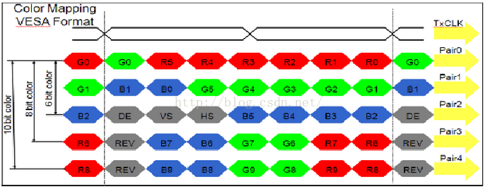
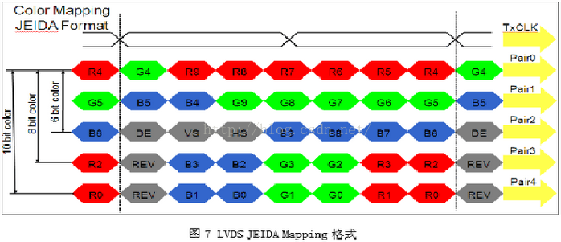

# OK6818液晶屏移植


## LVDS源码解析

arch\arm\plat-s5p6818\drone\include\cfg_main.h
里面定义了LVDS驱动的尺寸信息
``` C
/* LVDS */
#define CFG_DISP_PRI_LVDS_SCREEN_LAYER               	0
#define CFG_DISP_PRI_LVDS_SCREEN_RGB_FORMAT          	MLC_RGBFMT_A8R8G8B8
#define CFG_DISP_PRI_LVDS_SCREEN_PIXEL_BYTE	        4
#define CFG_DISP_PRI_LVDS_SCREEN_COLOR_KEY	        0x090909

#define CFG_DISP_PRI_LVDS_VIDEO_PRIORITY		2	// 0, 1, 2, 3
#define CFG_DISP_PRI_LVDS_BACK_GROUND_COLOR	     	0x000000

#define CFG_DISP_PRI_LVDS_MLC_INTERLACE              	CFALSE

#define	CFG_DISP_PRI_LVDS_LCD_WIDTH_MM			154
#define	CFG_DISP_PRI_LVDS_LCD_HEIGHT_MM			85

#define CFG_DISP_PRI_LVDS_RESOL_WIDTH          		1280	// X Resolution
#define CFG_DISP_PRI_LVDS_RESOL_HEIGHT			800	// Y Resolution

#define CFG_DISP_PRI_LVDS_HSYNC_SYNC_WIDTH           	1
#define CFG_DISP_PRI_LVDS_HSYNC_BACK_PORCH          	50
#define CFG_DISP_PRI_LVDS_HSYNC_FRONT_PORCH         	110
#define CFG_DISP_PRI_LVDS_HSYNC_ACTIVE_HIGH          	CFALSE
#define CFG_DISP_PRI_LVDS_VSYNC_SYNC_WIDTH           	1
#define CFG_DISP_PRI_LVDS_VSYNC_BACK_PORCH           	0
#define CFG_DISP_PRI_LVDS_VSYNC_FRONT_PORCH          	23
#define CFG_DISP_PRI_LVDS_VSYNC_ACTIVE_HIGH 	        CFALSE

#define CFG_DISP_PRI_LVDS_CLKGEN0_SOURCE             	DPC_VCLK_SRC_PLL2
#define CFG_DISP_PRI_LVDS_CLKGEN0_DIV                	8 // even divide
#define CFG_DISP_PRI_LVDS_CLKGEN0_DELAY              	0
#define CFG_DISP_PRI_LVDS_CLKGEN0_INVERT	     	0
#define CFG_DISP_PRI_LVDS_CLKGEN1_SOURCE             	DPC_VCLK_SRC_VCLK2
#define CFG_DISP_PRI_LVDS_CLKGEN1_DIV                	1
#define CFG_DISP_PRI_LVDS_CLKGEN1_DELAY              	0
#define CFG_DISP_PRI_LVDS_CLKGEN1_INVERT		0
#define CFG_DISP_PRI_LVDS_CLKSEL1_SELECT		0
#define CFG_DISP_PRI_LVDS_PADCLKSEL                  	DPC_PADCLKSEL_VCLK	/* VCLK=CLKGEN1, VCLK12=CLKGEN0 */

#define	CFG_DISP_PRI_LVDS_PIXEL_CLOCK			614000000/CFG_DISP_PRI_LCD_CLKGEN0_DIV

#define	CFG_DISP_PRI_LVDS_OUT_SWAPRB 			CFALSE
#define CFG_DISP_PRI_LVDS_OUT_FORMAT                 	DPC_FORMAT_RGB666
#define CFG_DISP_PRI_LVDS_OUT_YCORDER                	DPC_YCORDER_CbYCrY
#define CFG_DISP_PRI_LVDS_OUT_INTERLACE              	CFALSE
#define CFG_DISP_PRI_LVDS_OUT_INVERT_FIELD           	CFALSE

/*------------------------------------------------------------------------------
 * 	LVDS
 */
#define CFG_DISP_LVDS_LCD_FORMAT             	LVDS_LCDFORMAT_VESA
```

其中LVDS输出模式如下面的结构体定义

``` C
/*	LVDS output format. */
enum {
	LVDS_LCDFORMAT_VESA		= 0,
	LVDS_LCDFORMAT_JEIDA	= 1,
	LVDS_LCDFORMAT_LOC		= 2,
};
```

LVDS 数据映射标准
LVDS 数据映射（MappingMapping）标准

LVDS接口电路中，将像素的并行数据转换为串行数据的格式主要有两种标准：VESA和JEIDA

VSEA标准如下图所示：



JEIDA标准是由日本电子行业开发协会(JAPANELECTRONIC INDUSTRY DEVELOPMENT ASSOCIATION)制定的标准，其格式如下




## 编译脚本

飞凌提供的android系统编译脚本中参数解析部分如下

``` shell
function parse_args()
{
    TEMP=`getopt -o "b:r:m:t:i:d:a:k:chvs" -- "$@"`
    eval set -- "$TEMP"

    while true; do
        case "$1" in
            -b ) BOARD_NAME=$2; shift 2 ;;
			-m ) MEMSIZE=$2; shift 2;;
            -r ) ROOT_DEVICE_TYPE=$2; shift 2 ;;
            -c ) CLEAN_BUILD=true; shift 1 ;;
            -w ) WIFI_DEVICE_NAME=$2; shift 2 ;;
            -a ) ARM_ARCH=$2; shift 2 ;;
            -k ) KERNEL_VERSION=$2; shift 2 ;;
            -s ) SECURE=true; shift 1 ;;
            -t ) case "$2" in
                    u-boot  ) BUILD_ALL=false; BUILD_UBOOT=true ;;
                    kernel  ) BUILD_ALL=false; BUILD_KERNEL=true ;;
                    nxupdate) BUILD_ALL=false; BUILD_NXUPDATE=true ;;
                    module  ) BUILD_ALL=false; BUILD_MODULE=true ;;
                    android ) BUILD_ALL=false; BUILD_ANDROID=true ;;
                    dist    ) BUILD_ALL=false; BUILD_DIST=true ;;
                    none    ) BUILD_ALL=false ;;
                 esac
                 shift 2 ;;
            -i ) OTA_INCREMENTAL=true; OTA_PREVIOUS_FILE=$2; shift 2 ;;
            -d ) case "$2" in
                    2ndboot ) OTA_UPDATE_2NDBOOT=false ;;
                    u-boot  ) OTA_UPDATE_UBOOT=false ;;
                 esac
                 shift 2 ;;
            -h ) usage; exit 1 ;;
            -v ) VERBOSE=true; shift 1 ;;
            -- ) break ;;
            *  ) echo "invalid option $1"; usage; exit 1 ;;
        esac
    done
}
```

可以通过-t参数指定编译的模块，可以避免编译整个android系统

#### 在线更新内核方法

如果只想单独更新eMMC上的内核来测试，则需要先正常启动板，然后mount eMMC的boot分区，使用新编译的uImage来替换原有文件，完成后reboot即可。
从eMMC启动时可通过以下方法来更新内核：
1) 启动完成后，需要手动mount eMMC的boot分区(设备是/dev/mmcblk0p1), 可通过串口在板上操作:
```
su
mount -t ext4 /dev/block/mmcblk0p1 /mnt/media_rw/sdcard1/
```
2) 连接USB，在PC端Ubuntu下使用adb push命令复制新编译的uImage到已mount的boot分区下;
```
adb push uImage /mnt/media_rw/sdcard1/
```
