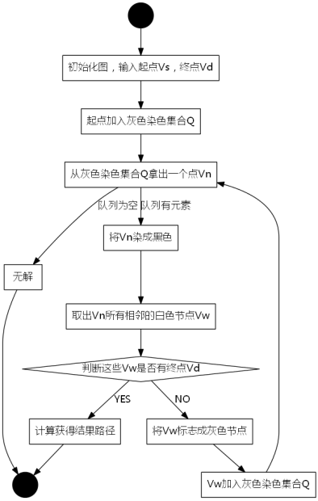

# 笔试常用算法


## DFS


``` C
void dfs(答案,搜索层数,其他参数){
    if(层数==maxdeep){
        更新答案;
        return;
    }
    (剪枝)
    for(枚举下一层可能的状态){
        更新全局变量表示状态的变量;
        dfs(答案+新状态增加的价值,层数+1,其他参数);
        还原全局变量表示状态的变量;
    }
}
```

## BFS





``` C
/**
 * 广度优先搜索
 * @param Vs 起点
 * @param Vd 终点
 */
bool BFS(Node& Vs, Node& Vd){
    queue<node> Q;
    Node Vn, Vw;
    inti;
    //初始状态将起点放进队列Q
    Q.push(Vs);
    hash(Vw) = true;//设置节点已经访问过了！
    while(!Q.empty()){//队列不为空，继续搜索！
        //取出队列的头Vn
        Vn = Q.front();
        //从队列中移除
        Q.pop();
        while(Vw = Vn通过某规则能够到达的节点){
            if(Vw == Vd){//找到终点了！
                //把路径记录，这里没给出解法
                returntrue;//返回
            }
            if(isValid(Vw) && !visit[Vw]){
                //Vw是一个合法的节点并且为白色节点
                Q.push(Vw);//加入队列Q
                hash(Vw) = true;//设置节点颜色
            }
        }
    }
    return false;//无解
}
```

总的来说，BFS多用于寻找最短路径的问题，DFS多用于快速发现底部节点

## DP


总结:动态规划的思想就是利用 空间换时间，开辟独立的空间存储最优子解，求新问题解=子问题+状态转移，这样可以避免掉对于子问题的重复计算
1. 首先将问题分解为子问题
1. 确定状态空间
1. 进行状态转移
1. 确定边界状态

能用动规解决的问题的特点
+ 问题具有最优子结构性质，如果问题的最优解所包含的 子问题的解也是最优的，我们就称该问题具有最优子结 构性质
+ 无后效性。当前的若干个状态值一旦确定，则此后过程的演变就只和这若干个状态的值有关，和之前是采取哪种手段或经过哪条路径演变到当前的这若干个状态，没有关系
+ 重叠子问题

区间dp与线性dp
+ 线性dp是每个状态都由前一个而来
+ 区间dp则是由子区间而来，区间dp一般问的是某个区间的某个性质，区间dp从区间是1，是2，是3一步一步转化过来，区间为2就是两个区间为1想加，这样所有区间为2的都就转移出来，如果区间为4的，可能是区间1根区间3，也可能是区间2跟区间2，因为区间1区间2区间3所有情况都枚举过，所以直接枚举转移就好。。简单的区间dp代码有很强的套路性
