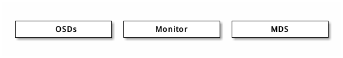
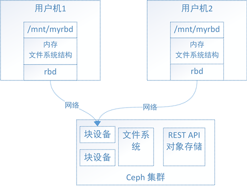
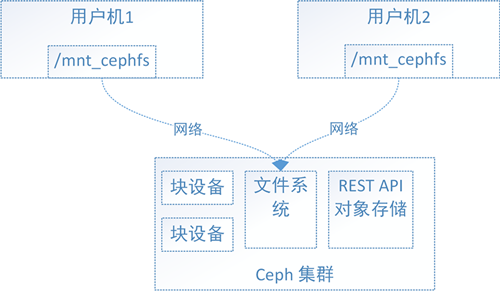
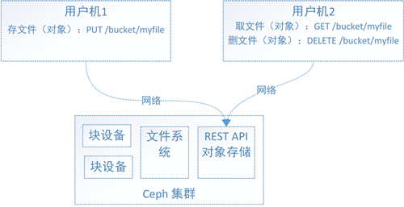
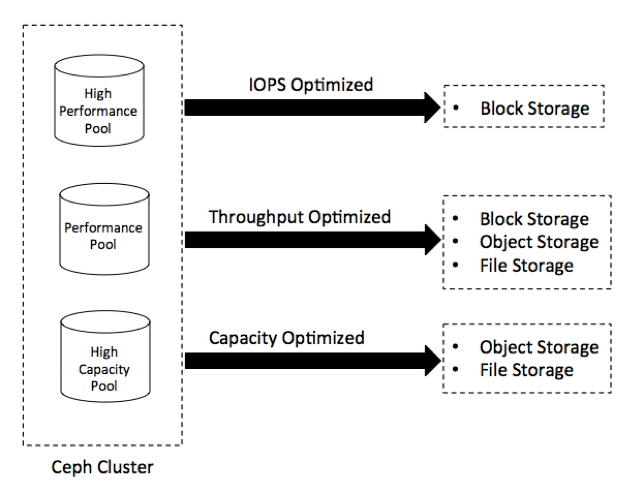

# ceph分布式存储

|修改日期|版本|负责人|
|--|--|--|
|2019.5.1|1.0|周星宇|

## ceph介绍

不管你是想为云平台提供Ceph 对象存储和/或 Ceph 块设备，还是想部署一个 Ceph 文件系统或者把 Ceph 作为他用，所有 Ceph 存储集群的部署都始于部署一个个 Ceph 节点、网络和 Ceph 存储集群。 Ceph 存储集群至少需要一个 Ceph Monitor 和两个 OSD 守护进程。而运行 Ceph 文件系统客户端时，则必须要有元数据服务器（ Metadata Server ）。

+ Ceph OSDs: Ceph OSD 守护进程（ Ceph OSD ）的功能是存储数据，处理数据的复制、恢复、回填、再均衡，并通过检查其他OSD 守护进程的心跳来向 Ceph Monitors 提供一些监控信息。当 Ceph 存储集群设定为有2个副本时，至少需要2个 OSD 守护进程，集群才能达到 active+clean 状态（ Ceph 默认有3个副本，但你可以调整副本数）。
+ Monitors: Ceph Monitor维护着展示集群状态的各种图表，包括监视器图、 OSD 图、归置组（ PG ）图、和 CRUSH 图。 Ceph 保存着发生在Monitors 、 OSD 和 PG上的每一次状态变更的历史信息（称为 epoch ）。
+ MDSs: Ceph 元数据服务器（ MDS ）为 Ceph 文件系统存储元数据（也就是说，Ceph 块设备和 Ceph 对象存储不使用MDS ）。元数据服务器使得 POSIX 文件系统的用户们，可以在不对 Ceph 存储集群造成负担的前提下，执行诸如 ls、find 等基本命令。

### ceph块设备存储

块设备可理解成一块硬盘，用户可以直接使用不含文件系统的块设备，也可以将其格式化成特定的文件系统，由文件系统来组织管理存储空间，从而为用户提供丰富而友好的数据操作支持。

用户可以在块设备上创建xfs文件系统，也可以创建ext4等其他文件系统。Ceph集群实现了自己的文件系统来组织管理集群的存储空间，用户可以直接将Ceph集群的文件系统挂载到用户机上使用。

### ceph文件系统

Ceph有了块设备接口，在块设备上完全可以构建一个文件系统，那么Ceph为什么还需要文件系统接口呢？

主要是因为应用场景的不同，Ceph的块设备具有优异的读写性能，但不能多处挂载同时读写，目前主要用在OpenStack上作为虚拟磁盘，而Ceph的文件系统接口读写性能较块设备接口差，但具有优异的共享性。PS：想了解更多？快去查查SAN和NAS。
为什么Ceph的块设备接口不具有共享性，而Ceph的文件系统接口具有呢？

对于Ceph的块设备接口，如图2，文件系统的结构状态是维护在各用户机内存中的，假设Ceph块设备同时挂载到了用户机1和用户机2，当在用户机1上的文件系统中写入数据后，更新了用户机1的内存中文件系统状态，最终数据存储到了Ceph集群中，但是此时用户机2内存中的文件系统并不能得知底层Ceph集群数据已经变化而维持数据结构不变，因此用户无法从用户机2上读取用户机1上新写入的数据。

对于Ceph的文件系统接口，如图3，文件系统的结构状态是维护在远端Ceph集群中的，Ceph文件系统同时挂载到了用户机1和用户机2，当往用户机1的挂载点写入数据后，远端Ceph集群中的文件系统状态结构随之更新，当从用户机2的挂载点访问数据时会去远端Ceph集群取数据，由于远端Ceph集群已更新，所有用户机2能够获取最新的数据。

### ceph对象存储

Ceph的块设备存储具有优异的存储性能但不具有共享性，而Ceph的文件系统具有共享性然而性能较块设备存储差，为什么不权衡一下存储性能和共享性，整个具有共享性而存储性能好于文件系统存储的存储呢，对象存储就这样出现了。
对象存储为什么性能会比文件系统好？

原因是多方面的，主要原因是对象存储组织数据的方式相对简单，只有bucket和对象两个层次（对象存储在bucket中），对对象的操作也相对简单。而文件系统存储具有复杂的数据组织方式，目录和文件层次可具有无限深度，对目录和文件的操作也复杂的多，因此文件系统存储在维护文件系统的结构数据时会更加繁杂，从而导致文件系统的存储性能偏低。

参考:
+ https://www.jianshu.com/p/2246464306b2

### 存储方式选型

Ceph是一个开源分布式统一存储，同时支持块、对象、文件三种存储。可以根据自己的使用场景需求来制定和选择不同的硬件。Ceph的硬件选型需要根据你的环境和存储需求做出选型计划。硬件的类型、网络和集群设计，是你在Ceph集群设计前期需要考虑的一些关键因素。Ceph选型没有黄金法则，因为它依赖各种因素，比如预算、性能和容量、或者两种的结合、容错性、以及使用场景。下面简单分析下三种常见场景搭配。

+ 高性能场景这种配置的类型亮点在于它在低TCO（ownership的总消耗）下每秒拥有最高的IOPS。典型的做法是使用包含了更快的SSD硬盘、PCIe SSD、NVMe做数据存储的高性能节点。通常用于块存储，但是也可以用在高IOPS的工作负载上
+ 通用场景亮点在于高吞吐量和每吞吐量的低功耗。通用的做法是使用SSD和PCIe SSD做OSD日志盘，以及一个高带宽、物理隔离的双重网络。这种方法常用于块存储，如果你的应用场景需要高性能的对象存储和文件存储，也可以考虑使用。
+ 大容量场景亮点在于数据中心每TB存储的低成本，以及机架单元物理空间的低成本。也被称为经济存储、廉价存储、存档/长期存储。通用的做法是使用插满机械硬盘的密集服务器，一般是36到72，每个服务器4到6T的物理硬盘空间。通常用于低功耗、大存储容量的对象存储和文件存储。一个好的备选方案，是采用纠删码来最大化存储容量。

### 硬件设备

#### CPU
Ceph metadata server会动态的重新分配负载，它是CPU敏感性的，所以Metadata Server应该有比较好的处理器性能 (比如四核CPU)。

Ceph OSD运行RADOS服务，需要通过CRUSH来计算数据的存放位置，replicate数据，以及维护Cluster Map的拷贝，因此OSD也需要合适的处理性能。

Ceph Monitors 简单的维护了Cluster Map的主干信息所以这个是CPU不敏感的。

#### RAM内存
Metadata servers 以及Monitors 必须能够快速的提供数据，因此必须有充足的内存(至少每个进程1GB)。OSD在日常操作时不需要过多的内存 (如每进程500MB);但是在执行恢复操作时，就需要大量的内存(如每进程每TB数据需要约1GB内存). Generally, 内存越多越好。

#### Data Storage数据存储
规划数据存储时要考虑成本和性能的权衡。同时OS操作，同时多个后台程序对单个驱动器进行读写 操作会显着降低性能。也有文件系统的限制考虑：BTRFS对于生产环境来说不是很稳定，但有能力记录journal和并行的写入数据，相对而言XFS和EXT4会好一点。

#### Network
建议每台机器最少两个千兆网卡，现在大多数机械硬盘都能达到大概 100MB/s 的吞吐量，网卡应该能处理所有 OSD 硬盘总吞吐量，所以推荐最少两个千兆网卡，分别用于公网（前端）和集群网络（后端）。集群网络（最好别连接到外网）用于处理由数据复制产生的额外负载，而且可防止拒绝服务攻击，拒绝服务攻击会干扰数据归置组，使之在 OSD 数据复制时不能回到 active + clean 状态。

一般生产环境会建议考虑部署万兆网卡。下面可以算一笔账，假设通过 1Gbps 网络复制 1TB 数据需要耗时 3 小时，而 3TB （典型配置）就需要 9 小时，相比之下，如果使用 10Gbps 复制时间可分别缩减到 20 分钟和 1 小时。所以一般使用Ceph都会上万兆网卡。

#### 硬盘
Ceph集群的性能很大程度上取决于存储介质的有效选择。你应该在选择存储介质之前了解到集群的工作负载和性能需求。Ceph使用存储介质有两种方法：OSD日志盘和OSD数据盘。Ceph的每一次写操作分两步处理。当一个OSD接受请求写一个object，它首先会把object写到acting set中的OSD对应的日志盘，然后发送一个写确认给客户端。很快，日志数据会同步到数据盘。值得了解的是,在写性能上，副本也是一个重要因素。副本因素通常要在可靠性、性能和TCO之间平衡。通过这种方式，所有的集群性能围绕着OSD日志和数据盘了。

参考:
+ http://ceph.org.cn/2016/09/13/%E4%BB%8E%E4%BC%A0%E7%BB%9F%E8%BF%90%E7%BB%B4%E5%88%B0%E4%BA%91%E8%BF%90%E7%BB%B4%E6%BC%94%E8%BF%9B%E5%8E%86%E7%A8%8B%E4%B9%8B%E8%BD%AF%E4%BB%B6%E5%AE%9A%E4%B9%89%E5%AD%98%E5%82%A8%EF%BC%88%E4%B8%80/

## ceph文件系统

参考:
+ https://blog.csdn.net/zzq900503/article/details/80470785
