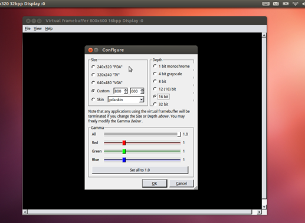
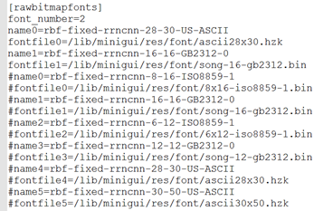

# miniGUI环境搭建

## 0.安装Ubuntu-12.04.5-32位系统

安装方法参考百度经验：

https://jingyan.baidu.com/article/ff42efa9423991c19e22020d.html

使用资料文件里提供的镜像
ubuntu-12.04.5-desktop-i386.iso

## 1.安装arm-linux-gcc

解压：
```
tar –xvzf arm-linux-gcc3_4_5.tar.gz –C <你想安装的目录>
```
添加环境变量：
```
gedit ~/.bashrc
```

在文档末尾加入：
```
export PATH=/<安装的目录>/3.4.5/bin:$PATH
export GCC_COLORS=auto
```
然后运行脚本
```
source ~/.bashrc
```
终端中运行：
```
arm-linux-gcc -v
```
如果输出版本信息，证明arm-linux-gcc安装成功

## 2.安装qvfb

安装相关库：
```
apt-get install build-essential
apt-get install zlib1g-dev libjpeg62* libpng12*
apt-get install qt4-dev-tools
```
安装的qt4-dev-tools自带qvfb工具，但是使用那个工具肯能会出现运行ana程序不能响应鼠标键盘事件的问题，所以这里推荐使用资料里提供的编译好的qvfb。

首先删除qt4-dev-tools自带qvfb。
```
rm /usr/bin/qvfb
```
解压资料里的qvfb
```
tar –xvzf qvfb-1.0-out.tar.gz –C /usr/share/
```
编辑~/.bashrc修改系统环境变量
```
gedit ~/.bashrc
```
在~/.bashrc最后面加入如下语句
```
export PATH=$PATH:/usr/share/qvfb-1.0/qvfb
```
然后运行脚本
```
source ~/.bashrc
```
运行qvfb时如果报错找不到libqt-mt.so,则使用如下语句安装依赖包：
```
apt-get install libqt3-mt
```

运行qvfb，并按下图的方式这只分辨率和颜色深度。
！：如果设置界面和下图不一样可能说明qvfb版本不同，可能是设置环境变量不成功。



## 3.编译安装FreeType字体支持

安装FreeType，支持freetype的1.6.10源码是照着1.3.3改的，对应的FreeType版本是1.3.1，因此找到对应的版本进行安装。
1. 下载地址: http://download.csdn.net/detail/u010240099/5529711 此处已将下载好的压缩包放入tools目录
2. FreeType1.3.1源码有个问题，会导致编译不通过。
```
       ftdump.c:172:1: 错误：毗连“.”和“glyph_object”不能给出一个有效的预处理标识符
        ftdump.c:182:1: 错误：毗连“.”和“first_instance”不能给出一个有效的预处理标识符
        ftdump.c:191:1: 错误：毗连“.”和“second_instance”不能给出一个有效的预处理标识符
        ftdump.c:201:1: 错误：毗连“.”和“face_object”不能给出一个有效的预处理标识符
        ftdump.c:202:1: 错误：毗连“.”和“glyph_object”不能给出一个有效的预处理标识符
        ftdump.c:203:1: 错误：毗连“.”和“second_instance”不能给出一个有效的预处理标识符
        ftdump.c:863:1: 错误：毗连“.”和“initial_overhead”不能给出一个有效的预处理标识符
        ftdump.c:882:1: 错误：毗连“.”和“face_object”不能给出一个有效的预处理标识符
```
解决：个错误是由于freetye1.3.1的测试程序写的有问题,你可以不安装这个 或者是修改ftdump.c里面的代码:
```
    Print_Mem( memory_footprint.##field, string )
    改为 : Print_Mem( memory_footprint.field, string )
    #define FOOTPRINT( field ) Save_Memory( &memory_footprint.##field )
    修改为:#define FOOTPRINT( field ) Save_Memory( &memory_footprint.field )
```
编译成功，可以运行Samples里的例子，像mPoint,mpaint，很强大

3. FreeType安装过程如下:  
        1、在root权限下make  
        2、make install命令安装  
        3、安装完成后会在/usr/local/lib路径下生成库文件libttf.so.2等等

添加ttf字体文件资源
    1、将字体放在/usr/local/lib/minigui/res/font目录下
    2、修改MiniGUI.cfg文件，增加[truetypefonts]下的条目

PS：运行程序如果报找不到libttf.so.2库文件的错误，则可以给libttf.so.2做一个软链接
```
    ln -s /usr/local/lib/libttf.so.2 /usr/lib/libttf.so.2
```
## 4.编译安装miniGUI

需要用到的压缩包清单如下：
+ libminigui-1.6.10.tar.gz
+ minigui-res-str-1.6.tar.gz

1.6.10版本把freetype功能裁掉了，因此起不支持矢量字体库。要实现1.6.10对ttf的支持，需要修改minigui库文件以及重新安装freetype库。网上有经过修改支持freetype的miniGUI代码，下载地址：http://download.csdn.net/detail/u010240099/5529809#comment

带有ttf字体支持的miniGUI源码已经放入tools文件夹中。miniGUI-res可以使用官网下载的。

安装libminigui-1.6.10：
```
tar –xvzf libminigui-1.6.10.tar.gz
cd libminigui-1.6.10
make	//这里要直接make，不能./configure。否则会破坏ttf字体支持
make install
```
安装minigui-res-str-1.6:
```
tar –xvzf minigui-res-str-1.6.tar.gz
cd minigui-res-str-1.6
make install
```

修改配置文件：
1.必须修改/etc/ld.so.conf 文件，将/usr/local/lib 添加到此文件中。因为我们将miniGUI安装了这个地方，要将miniGUI 的库添加进来，不然miniGUI 应用程序会找不到miniGUI 的库函数。修改完ld.so.conf 文件后，需运行如下命令：
```
# ldconfig ld.so.conf // 刷新可共享的动态链接库
```

2. 修改/usr/local/etc/MiniGui.cfg 文件。修改如下：
```
[system]
# GAL engine
gal_engine=qvfb					 //这里修改，开发时使用qvfb模拟
# IAL engine
ial_engine=qvfb 					//这里修改，同上
[qvfb]
defaultmode=800x600-16bpp 	// 改成所需要模拟屏幕分辨率的大小，这里我们使用的是800x600，16 位深度
```

minigui-res默认安装路径为/usr/local/lib/minigui/res/
安装完官方提供的minigui-res-str-1.6.tar.gz后可能会出现找不到部分资源文件的问题（尤其是ttf字体，miniGUI官方没有支持）。为了解决此类问题需要将res.tar.gz中的资源放入/usr/local/lib/minigui/路径中
```
tar –xvzf res.tar.gz
cp –r res/ /usr/local/lib/minigui/
```


## 5. miniGUI应用程序
Ps:本节介绍应用程序如何调用miniGUI库函数以及如何在PC机上运行基于miniGUI的应用程序。

使用TTF字体支持的应用程序需要注意以下两点：
1. 在程序中创建逻辑字体并使用
```
    font0=CreateLogFont(  FONT_TYPE_NAME_SCALE_TTF,
    "yahei", "GB2312",
    FONT_WEIGHT_REGULAR,
    FONT_SLANT_ROMAN,
    FONT_SETWIDTH_NORMAL,
    FONT_OTHER_NIL,
    FONT_UNDERLINE_NONE,
    FONT_STRUCKOUT_NONE, 100, 0 );

    SelectFont(hdc,font0);
```
2.编译程序需要加入 -lttf 库链接

一些常见问题及解决方法：

Does not find matched engine: qvfb.：这个是由于没有启动qvfb。应用程序需要先启动qvfb才能运行
```
GDI: Error in loading raw bitmap fonts!
GDI: Error in loading vbf fonts!
InitGUI: Count not init mouse cursor!：
```
这类问题都是因为miniGUI资源文件初始化存在问题，造成问题的原因有两个：
1.	/usr/local/etc/MiniGui.cfg文件内容不正确
2.	/usr/local/lib/minigui/res中的对应资源文件不存在或有问题。
以GDI: Error in loading raw bitmap fonts!为例：MiniGui.cfg文件中有下面的一段：



这条配置信息指定了raw bitmap fonts对应的名字与路径。如果在相应路径查找不到对应的资源文件的话miniGUI就会初始化错误。
解决：要么修改/usr/local/etc/MiniGui.cfg要么修改/usr/local/lib/minigui/res内容，使两个匹配。如果缺少资源文件就从别人已经装好的环境中考一份。

在本文档附带的tools文件夹中有一份完整的资源文件压缩包

找不到libttf.so.2库文件的错误，则可以给libttf.so.2做一个软链接
```
ln -s /usr/local/lib/libttf.so.2 /usr/lib/libttf.so.2
```
## 6. 交叉编译miniGUI
