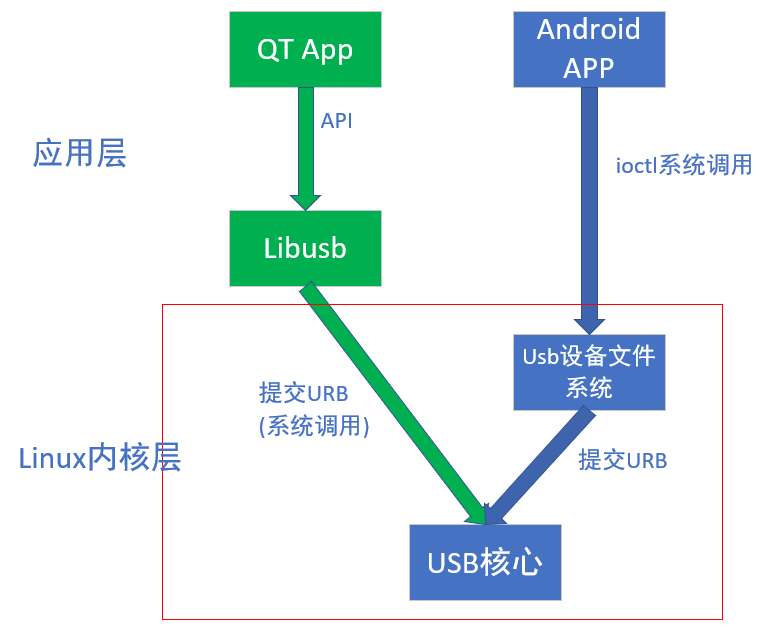

# linux USB 通信

版本|日期|作者
--|--|--
1.0  |   |周星宇  

## 方案概述

和Android系统的USB驱动框架进行对比



## 交叉编译libusb


下载libusb源码

执行下列命令进行编译

```
./configure --build=i686-linux --host=arm-linux --prefix=/home/forlinx/libusb
make
make install
```

其中:
+ –build=i686-linux表示该软件在x86平台被编译
+ –host=arm-linux表示该软件编译完成后在arm平台上运行
+ –prefix后面为软件安装目录。

交叉编译方法参考：
https://blog.csdn.net/xfc_1939/article/details/53422071

编译成功后将–prefix指定的输出文件夹拷贝到QT工程路径中。

## libusb使用

修改pro文件将编译生成的.so文件包含到QT工程中。
```
INCLUDEPATH += "$$PWD/libusb/include/libusb-1.0"
LIBS += -L$$PWD/libusb/lib -lusb-1.0
```
使用可以参考libusb源码examples文件夹下的例子。


### USB设备枚举

``` c
   int config = 0;
   libusb_get_configuration(dev_handle, &config);
   printf("config num=%d \n",desc.bNumConfigurations);
   for (int c = 0; c < desc.bNumConfigurations; c++) {
       struct libusb_config_descriptor*config;
       ret = libusb_get_config_descriptor(dev, c, &config);
       if (LIBUSB_SUCCESS != ret) {
           printf("  Couldn't retrieve descriptors\n");
           continue;
       }

       int interface_num = config->bNumInterfaces;
       printf("interface num=%d \n",interface_num);
       libusb_interface interface = config->interface[0];
       int descriptor_num = interface.num_altsetting;
       printf("descriptor num=%d \n",descriptor_num);
       libusb_interface_descriptor interfaceDescriptor = interface.altsetting[0];
       interfaceNumber = interfaceDescriptor.bInterfaceNumber;
       int endpoint_num = interfaceDescriptor.bNumEndpoints;
       printf("endpoint num=%d \n",endpoint_num);
       for(int e=0;e<endpoint_num;e++){
           libusb_endpoint_descriptor endpoint = interfaceDescriptor.endpoint[e];
           uint8_t address =  endpoint.bEndpointAddress;
           if(address>=0x80){
               endpointIn = address;
           }
           else{
               endpointOut = address;
           }
       }

//     libusb_free_config_descriptor(config);
   }
```

### USB读写

### USB设备热插拔

libusb支持热插拔检测，将热插拔响应作为回调函数的形式注册到libusb模块，USB设备插入后系统会自动回调注册的函数。

具体不做介绍，参考官方例程

## 速度测试结果

使用平台：mx6UL

  | 最大  | 最小  |  平均
--|---|---|--
只开USB| 40MB/s  | 20MB/s  |  30MB/s
USB和显示都开| 9MB/s  | 11MB/s  |  12MB/s

MX6DL平台
  | 最大  | 最小  |  平均
--|---|---|--
USB+openGL| 16MB/s  | 15MB/s  |  15MB/s

虽然速度能满足要求，但是在这个速度下运行CPU占用比较多，所以CPU处理性能是否满足要求还不清楚
