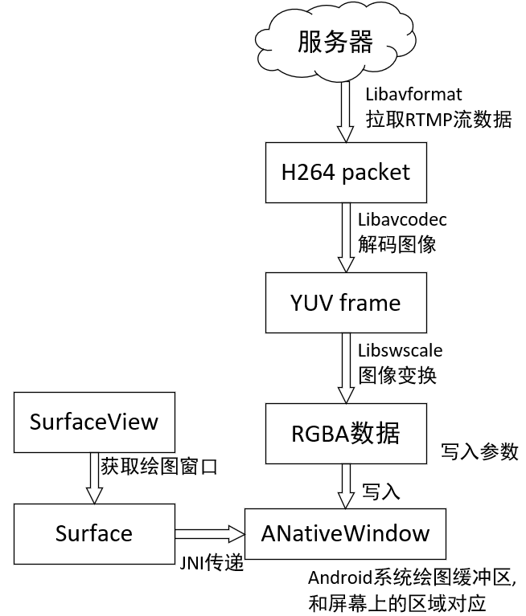
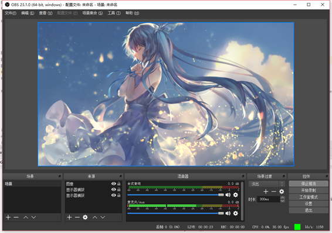
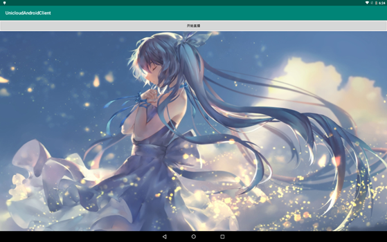

# android端RTMP播放方案

## 1.播放原理

播放分为拉流、解码、显示三个部分。三个部分的关系如下图

## 2.播放程序

## 3.播放效果

推流端使用obs studio测试

程序拉取到的图像

## 4.参考

+ android ffmpeg视频硬解码例子: https://blog.csdn.net/lakebobo/article/details/79619584
