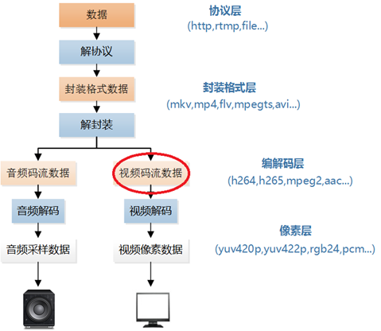
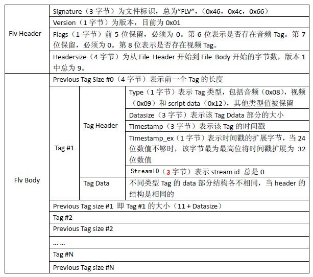
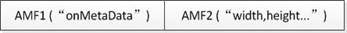

# 流媒体基础

## 0.流媒体处理整体流程

## 1.H264编码

H264编码器

H264解码流程

### 264参数

## 2.FLV封装

### 2.1 FLV整体格式

总体上看，FLV包括文件头（File Header）和文件体（File Body）两部分，其中文件体由一系列的Tag组成。

其中，每个Tag前面还包含了Previous Tag Size字段，表示前面一个Tag的大小。Tag的类型可以是视频、音频和Script，每个Tag只能包含以上三种类型的数据中的一种。

### 2.2 视频Tag data格式

视频Tag也用开始的第1个字节包含视频数据的参数信息，从第2个字节为视频流数据。

第1个字节的前4位的数值表示帧类型。

值  | 含义
--|--
1  |  keyframe (for AVC，a seekable frame)
2  |  inter frame (for AVC，a nonseekable frame)
3  |  disposable inter frame (H.263 only)
4  |  generated keyframe (reserved for server use)
5  |  video info/command frame

第1个字节的后4位的数值表示视频编码类型

值  | 含义
--|--
1  |  JPEG (currently unused)
2  |  Sorenson H.263
3  |  Screen video
4  |  On2 VP6
5  |  On2 VP6 with alpha channel
6  |  Screen video version 2
7  |  AVC

### 2.3 Script Tag Data结构（控制帧）

该类型Tag又通常被称为Metadata Tag，会放一些关于FLV视频和音频的元数据信息如：duration、width、height等。通常该类型Tag会跟在File Header后面作为第一个Tag出现，而且只有一个。

第一个AMF包：

第1个字节表示AMF包类型，一般总是0x02，表示字符串。第2-3个字节为UI16类型值，标识字符串的长度，一般总是0x000A（“onMetaData”长度）。后面字节为具体的字符串，一般总为“onMetaData”（6F,6E,4D,65,74,61,44,61,74,61）。

第二个AMF包：

第1个字节表示AMF包类型，一般总是0x08，表示数组。第2-5个字节为UI32类型值，表示数组元素的个数。后面即为各数组元素的封装，数组元素为元素名称和值组成的对。常见的数组元素如表7所示。

值|含义
--|--
duration|时长
width|视频宽度
height|视频高度
videodatarate|视频码率
framerate|视频帧率
videocodecid|视频编码方式
audiosamplerate|音频采样率
audiosamplesize|音频采样精度
stereo|是否为立体声
audiocodecid|音频编码方式
filesize|文件大小

## 3.RTMP协议

## 4.参考
+ 雷霄骅博客: https://blog.csdn.net/leixiaohua1020/article/details/15811977/
