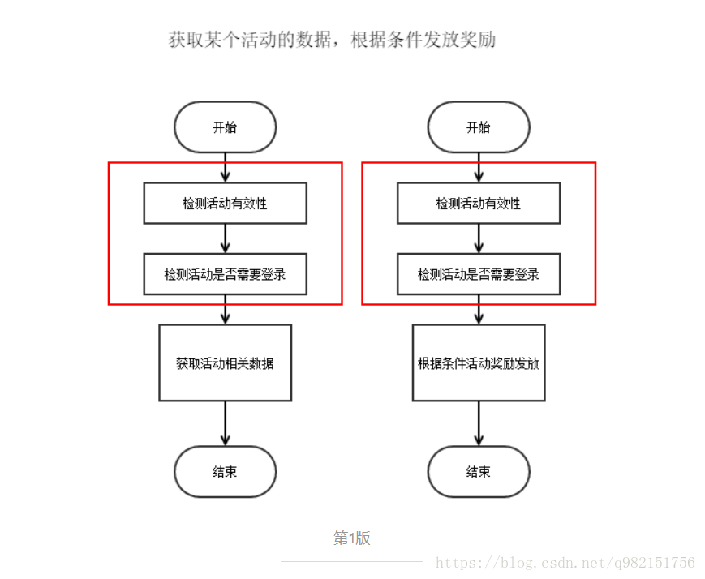
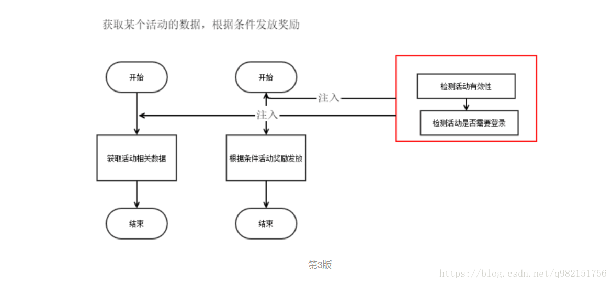

# spring aop

## 面向切面编程

Aspect Oriented Programming(AOP)，面向切面编程，是一个比较热门的话题。AOP主要实现的目的是针对业务处理过程中的切面进行提取，它所面对的是处理过程中的某个步骤或阶段，以获得逻辑过程中各部分之间低耦合性的隔离效果。






## 切入点表达式(aspactj)

1、切入点表达式：对指定的方法进行拦截，并且生成代理表达式。

2、拦截所有public方法

```
<aop:pointcut expression="execution(public * *(..))" id="pt"/>
```
3、拦截所有save开头的方法

```
<aop:pointcut expression="execution(* save*(..))" id="pt"/>
```
4、拦截指定类的指定方法
```
<aop:pointcut expression="execution(public * 包名.类名.方法名(..))" id="pt"/>
```

5、拦截指定类的所有方法

```
<aop:pointcut expression="execution(* 包名.类名.*(..))" id="pt"/>
```
6、拦截指定包，以及其自包下所有类的所有方法

```
<aop:pointcut expression="execution(* cn..*.*(..))" id="pt"/>
```

7、多个表达式
```
<aop:pointcut expression="execution(* 包名.类名.方法名()) || execution(* 包名.类名（不同的类）.方法名())" id="pt"/>
<aop:pointcut expression="execution(* 包名.类名.方法名()) or execution(* 包名.类名（不同的类）.方法名())" id="pt"/>
```
8、取非值
```
<aop:pointcut expression="!execution(* 包名.类名.方法名())" id="pt"/>
<aop:pointcut expression=" not execution(* 包名.类名.方法名())" id="pt"/>
```
