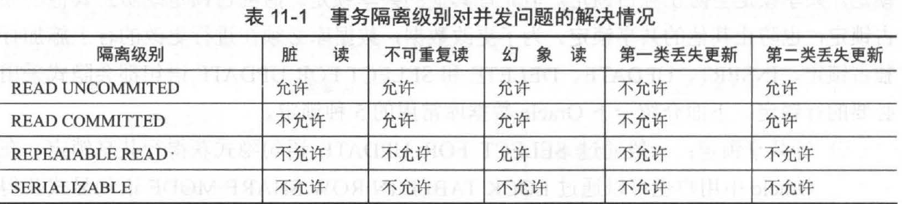

## 事务管理

### ACID

1. 原子性（Atomicity）
事务最基本的操作单元，要么全部成功，要么全部失败，不会结束在中间某个环节。事务在执行过程中发生错误，会被回滚到事务开始前的状态，就像这个事务从来没有执行过一样。
1. 一致性（Consistency）
事务的一致性指的是在一个事务执行之前和执行之后数据库都必须处于一致性状态。如果事务成功地完成，那么系统中所有变化将正确地应用，系统处于有效状态。如果在事务中出现错误，那么系统中的所有变化将自动地回滚，系统返回到原始状态。
1. 隔离性（Isolation）
指的是在并发环境中，当不同的事务同时操纵相同的数据时，每个事务都有各自的完整数据空间。由并发事务所做的修改必须与任何其他并发事务所做的修改隔离。事务查看数据更新时，数据所处的状态要么是另一事务修改它之前的状态，要么是另一事务修改它之后的状态，事务不会查看到中间状态的数据。
1. 持久性（Durability）
指的是只要事务成功结束，它对数据库所做的更新就必须永久保存下来。即使发生系统崩溃，重新启动数据库系统后，数据库还能恢复到事务成功结束时的状态。

### 事务的传播特性
事务传播行为就是多个事务方法调用时，如何定义方法间事务的传播。Spring定义了7中传播行为：
（1）propagation_requierd：如果当前没有事务，就新建一个事务，如果已存在一个事务中，加入到这个事务中，这是Spring默认的选择。
（2）propagation_supports：支持当前事务，如果没有当前事务，就以非事务方法执行。
（3）propagation_mandatory：使用当前事务，如果没有当前事务，就抛出异常。
（4）propagation_required_new：新建事务，如果当前存在事务，把当前事务挂起。
（5）propagation_not_supported：以非事务方式执行操作，如果当前存在事务，就把当前事务挂起。
（6）propagation_never：以非事务方式执行操作，如果当前事务存在则抛出异常。
（7）propagation_nested：如果当前存在事务，则在嵌套事务内执行。如果当前没有事务，则执行与propagation_required类似的操作。

### 事务的隔离级别
（1）read uncommited：是最低的事务隔离级别，它允许另外一个事务可以看到这个事务未提交的数据。
（2）read commited：保证一个事物提交后才能被另外一个事务读取。另外一个事务不能读取该事物未提交的数据。
（3）repeatable read：这种事务隔离级别可以防止脏读，不可重复读。但是可能会出现幻象读。它除了保证一个事务不能被另外一个事务读取未提交的数据之外还避免了以下情况产生（不可重复读）。
（4）serializable：这是花费最高代价但最可靠的事务隔离级别。事务被处理为顺序执行。除了防止脏读，不可重复读之外，还避免了幻象读

