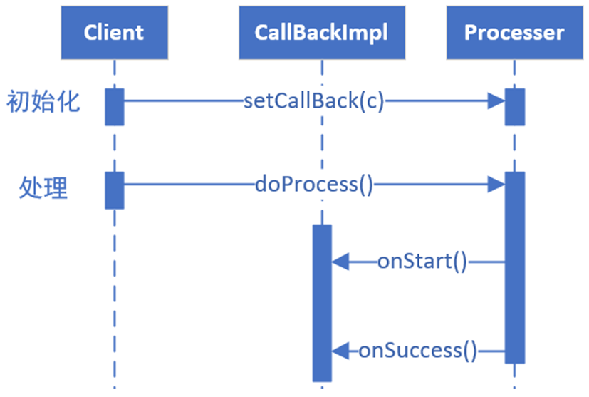
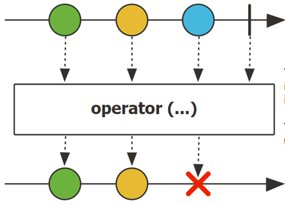
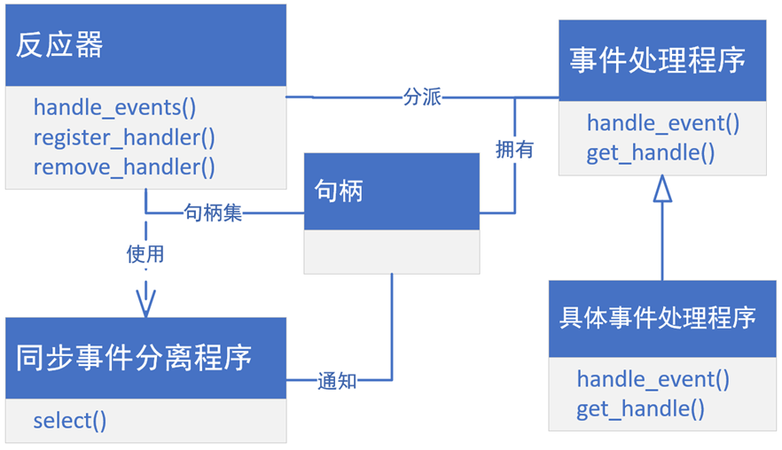
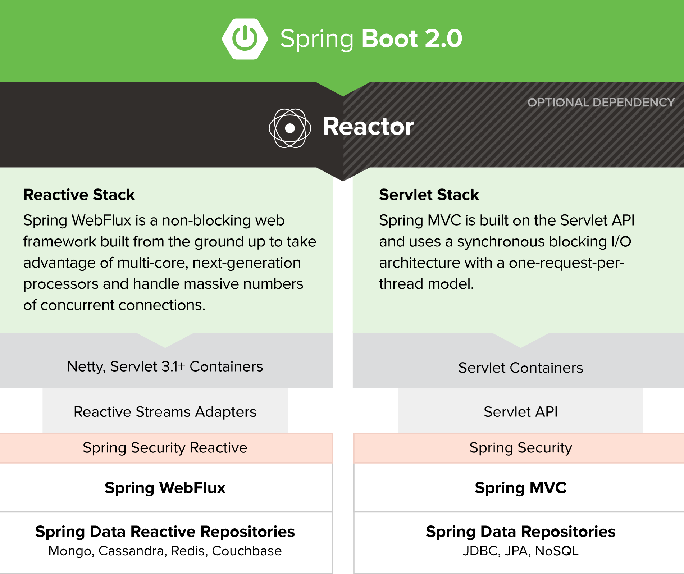
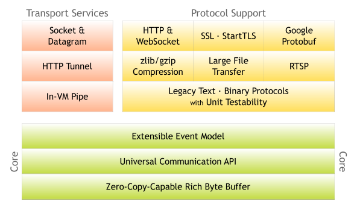

# 响应式编程

版本|日期|作者
--|--|--
1.0  |   |周星宇  

制造一个小型的网站或者移动APP，可以使用最简单的html、h5 等静态页面或者简单动态页面加数据库就实现了，此种网站只需要简单的系统架构，对于性能的要求不高。但是随着移动应用与网站等多种互联网产品的业务和应用不断壮大，访问用户不断增大，一般的技术架构势必无法承受大量用户高并发访问带来的压力。移动应用与大型网站等多个平台在处理大量用户访问及请求问题时，需要使用高并发的处理技术架构，或性能较高的数据量与服务器，又或是效率较高的编程语言。本文介绍响应式架构在高并发web服务器中的应用。

## 1 传统架构的挑战

处理服务端并发的一种方案是使用多线程并行化的处理用户请求，当请求处理结束时，线程进入阻塞状态等待新的请求到来。这种方案确实能够处理一定数量的并发，但是，这种方法会在在两个方面造成性能的问题。
+ 阻塞式IO会导致资源的浪费。线程阻塞时进入idle状态等待数据到来，而线程状频繁切换会导致CPU时间片调度的低效化。
+ 多线程模型会导致资源竞争和并发问题。而且解决程序并发问题的锁对象本身需要通过系统调用来进行操作，这样会对性能造成不利影响。
+ 操作系统的线程调度需要为每个线程维护执行的上下文信息，这样会导致CPU和内存的损失。
通过异步非阻塞的方法可以解决线程阻塞带来的资源浪费。在异步非阻塞的模式中，线程在调用IO资源后不需要阻塞等待IO任务的完成，而是调用之后立即返回，并持有一个Future对象。调用线程会在任务执行结束后得到异步通知。这种异步通知是通过回调函数的方式实现的，与设计模式中的观察者模式类似(如图1所示)。

图1:异步非阻塞的回调机制

但是这种使用回调函数的异步通知方法在复杂的处理逻辑中，回调中会层层嵌入回调导致“回调地狱”，增加程序的复杂性并降低程序的可读性和可维护性。

针对这些问题，响应式的架构应运而生。

## 2 响应式架构

### 2.1	响应式架构的特点

响应式编程有如下三个特点。变化传递、基于数据流和声明式编程。本节分别介绍这三个特点。

#### 2.1.1 变化传递

响应式架构不处理数据，而是维护一个数据处理方式的抽象。这样，当源端数据的变化会自动传递到目的端，而不需要主动的进行方法调用。

为了实现变化传递，可通过直接调用来传播变更，但这种解决方案既不灵活又不可重用。我们需要找到一种更通用、适用于众多情形的变更传播机制。

Publisher-subscriber模式有助于让相互协作的纽件的状态保持同步。为此，它实现了单向变更传播:发布者的状态发生变化时可通知任意数量的订阅者。发布者维护一个注册表，其中包含当前所有的订阅者组件。要成为订阅者，组件可使用发布者提供的订阅接口。

#### 2.1.2 数据流

响应式框架将客户端请求以数据流管道的形式进行组织。数据流的每一个节点都代表对数据的一个处理流程，类似于多级流水线的结构。源端产生的每一个数据都会顺序的流经管道的各个节点接受处理，并最终被订阅者消费(如图2所示)。

当数据处理发生错误时，管道会使用错误标记填补到数据流中，当数据流到达消费者时由错误处理回调函数进行处理。

图2:响	应式数据流

#### 2.1.3 声明式编程

声明式编程的概念相对于传统的命令式编程来定义的。传统的命令式面向事务处理的过程，而声明式是面向数据处理模块结构的。这也就意味着声明式编程只定义数据处理的方法和数据间的关系，而不对具体数据进行处理。而具体的数据则是通过Publisher-subscriber模式注入到处理流中。

结合变化传递的特性即可理解响应式相对于传统编程方案的改进。

### 2.2 reactor模式

Reactor模式作为响应式的事件处理模型，目前在处理web服务端并发方面拥有广泛的应用。

对应用提供的每个服务，添加一个单独的事件处理程序用于处理来自特定事件源的特定类型的事件。事件处理程序注册一个反应器组件，该组件使用同步事件分离程序等待接收来自一个或多个事件源的指示事件。当指示事件发生时，同步事件分离程序通知反应器组件(如图3所示)。

图3: reactor模式

Reactor模式分为如下的组件:
+ 句柄由操作系统提供，用于识别网络连接或文件打开等事件源，这些事件源能够产生指示事件，并将事件插入队列
+ 同步事件分离程序是一个函数，该函数调用用于等待一个或多个事件在一系列句柄也就是句柄集上的发生。当句柄集上的指示事件通知同步事件分离程序句柄集中有一个或多个句柄状态已经变为"就绪"时，则可以在这些句柄上发起相关的操作。
+ 事件处理程序指定了一个接口，该接口由一个或多个钩子方法组成
+ 具体事件处理程序是一种专门的事件处理程序，实现了应用程序提供的具体服务

反应器定义了一个接口，应用程序可以使用该接口来注册或删除事件处理程序及相关联的句柄，运行该应用程序的事件循环。反应器使用自身的同步事件分离程序等待指示事件在相关联的句柄集上发生。事件发生时，反应器首先从发生事件的句柄上分离出每个事件，交给相应的事件处理程序，然后再将其分派给处理程序中合适的钩子方法，由它对事件进行处理。

Reactor模式在应用系统内部实现了"颠倒"控制流。等待指示事件的发生，将这些事件分离到相应的事件处理程序，并分派事件处理程序中合适的钩子方法这些都是由反应器实现的功能，而不是由应用程序来实现。反应器不是由具体的事件处理程序来调用，而是由反应器来分派具体的事件处理程序，由具体事件处理程序对具体事件的发生做出反应。

### 2.3 spring webflux响应式框架

Spring webflux是Spring Framework 5.0中引入的响应式web服务端开发框架。该框架支持srping boot的自动化配置且拥有和spring其他框架很好的兼容性具有开箱即用和易于开发的特点(如图4所示)。

相对于传统的servlet框架，webflux框架具有如下的优点:
+ webflux基于异步非阻塞的Netty容器实现了基于reactor模式的事务处理模型。克服了servlet框架阻塞式事务处理产生的性能瓶颈
+ webflux还兼容了reactive stream规范，为上层应用提供响应式编程接口。
+ webflux框架完全兼容spring MVC基于注解的编程接口，使响应式开发更加容易。

#### netty框架

## 参考

+ reactor API: https://projectreactor.io/docs/core/release/api/
+ Reactor 3 Reference Guide: https://projectreactor.io/docs/core/release/reference/
+ spring webflux: https://docs.spring.io/spring/docs/5.1.6.RELEASE/spring-framework-reference/web-reactive.html
+ 响应式Spring的道法术器: https://blog.csdn.net/get_set/article/details/79466657
+ Spring Boot 2.0 WebFlux 上手系列课程: https://blog.csdn.net/jeffli1993/article/details/79941175
+ https://htmlpreview.github.io/?https://github.com/get-set/reactor-core/blob/master-zh/src/docs/index.html#processors
