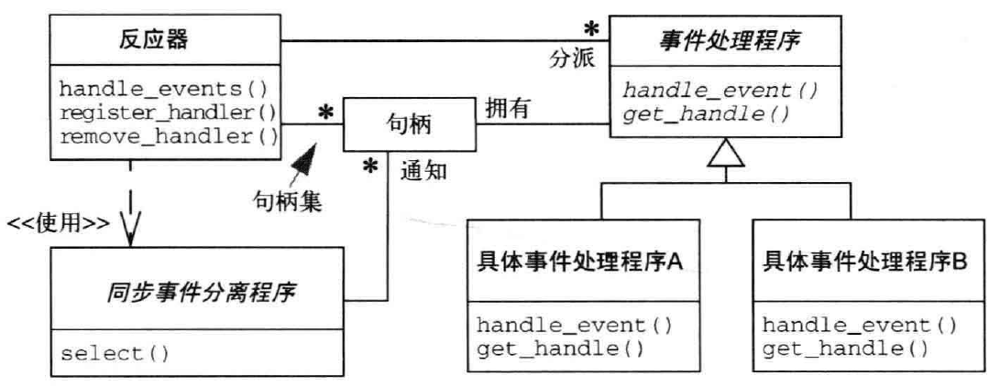
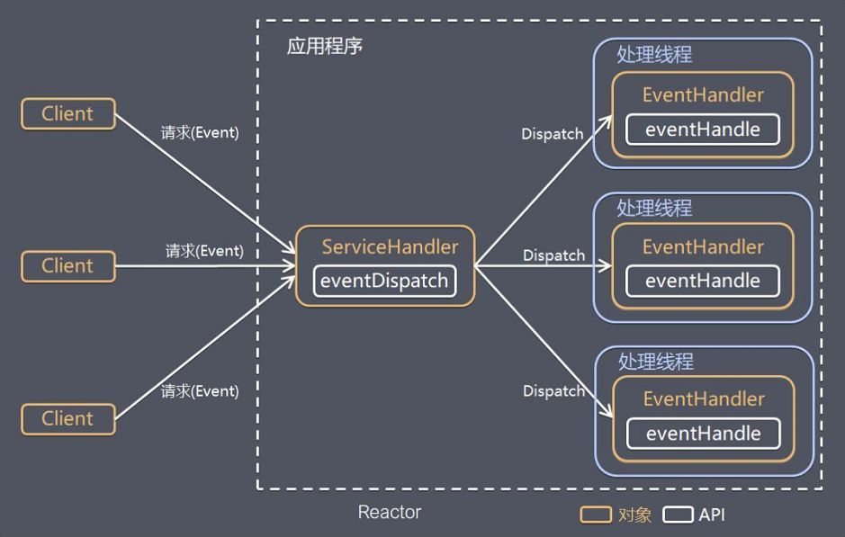

# 响应式编程

## 响应式编程介绍

### 阻塞式编程

现代应用程序可以覆盖大量并发用户，即使现代硬件的功能不断提高，现代软件的性能仍然是一个关键问题。

人们可以通过两种方式来提高计划的绩效：

+ 并行化：使用更多线程和更多硬件资源。
+ 在现有资源的使用方式上寻求更高的效率。

通常，Java开发人员使用阻塞代码编写程序。这种做法很好，直到出现性能瓶颈，此时需要引入额外的线程，运行类似的阻塞代码。但是，资源利用率的这种扩展会很快引入争用和并发问题。

更糟糕的是，阻止浪费资源。如果仔细观察，一旦程序涉及一些延迟（特别是I/O，例如数据库请求或网络调用），资源就会被浪费，因为线程（或许多线程）现在处于空闲状态，等待数据。

### 异步回调式编程

第二种方法（前面提到过），寻求更高的效率，可以解决资源浪费问题。通过编写异步，非阻塞代码，可以使用相同的底层资源将执行切换到另一个活动任务，然后在异步处理完成后返回到当前进程。

+ 回调：异步方法没有返回值，但需要一个额外的 callback参数（lambda或匿名类），当结果可用时，它会被调用。一个众所周知的例子是Swing的EventListener层次结构。
+ future：异步方法Future<T> 立即返回。异步进程计算一个T值，但该Future对象包含对它的访问。该值不会立即可用，并且可以轮询对象，直到该值可用。例如，ExecutorService运行Callable<T>任务使用Future对象。

响应式编程是基于异步和事件驱动的非阻塞程序，只是垂直通过在 JVM 内启动少量线程扩展，而不是水平通过集群扩展。

参考文档

## spring webFlux

## netty框架

## reactor模式

#### 解决方案
对应用提供的每个服务，添加一个单独的事件处理程序用于处理来自特定事件源的特定类型的事件。事件处理程序注册一个反应器组件，该组件使用同步事件分离程序等待接收来自一个或多个事件源的指示事件。当指示事件发生时，同步事件分离程序通知反应器组件，由反应器组件同步地将事件分派到相关的事件处理程序，这样事件处理程序就可以运行该事件请求的服务了。

#### 结构
+ `同步事件分离程序`是一个函数，该函数调用用于等待一个或多个事件在一系列句柄也就是句柄集(handle set)上的发生。在句柄集上没有事件发生时，该函数调用会被阻塞;当句柄集上的指示事件通知同步事件分离程序句柄集中有一个或多个句柄状态已经变为"就绪"时，这就意味着不用再阻塞它们，可以在这些句柄上发起相关的操作。
+ `事件处理程序`指定了一个接口，该接口由一个或多个钩子方法( hook method )组成
+ `具体事件处理程序`是一种专门的事件处理程序，实现了应用程序提供的具体服务。每个具体的事件处理程序同一个句柄相关联，通过该句柄在应用程序内标识该服务。具体事件处理程序实现了负责处理指示事件的钩子方法，这些指示事件通过相关联的句柄进行接收。服务运行的任何结果都可以通过写入句柄的输出返回给调用者。
+ `反应器`定义了一个接口，应用程序可以使用该接口来注册或删除事件处理程序及相关联的句柄，运行该应用程序的事件循环( event loop )。反应器使用自身的同步事件分离程序等待指示事件在相关联的句柄集上发生。事件发生时，反应器首先从发生事件的句柄上分离出每个事件，交给相应的事件处理程序，然后再将其分派给处理程序中合适的钩子方法，由它对事件进行处理。

下面这张结构图更好理解

#### 颠倒控制法则
Reactor模式引入的结构在应用程序内部"颠倒"控制流。等待指示事件的发生，将这些事件分离到相应的事件处理程序，并分派事件处理程序中合适的钩子方法这些都是由反应器实现的功能，而不是由应用程序来实现。特别注意反应器不是由具体的事件处理程序来调用，而是由反应器来分派具体的事件处理程序，由具体事件处理程序对具体事件的发生做出反应。这种"颠倒控制"的法则又被称为妓莱坞法则

## 参考

+ reactor API: https://projectreactor.io/docs/core/release/api/
+ Reactor 3 Reference Guide: https://projectreactor.io/docs/core/release/reference/
+ spring webflux: https://docs.spring.io/spring/docs/5.1.6.RELEASE/spring-framework-reference/web-reactive.html
+ 响应式Spring的道法术器: https://blog.csdn.net/get_set/article/details/79466657
+ Spring Boot 2.0 WebFlux 上手系列课程: https://blog.csdn.net/jeffli1993/article/details/79941175
+ https://htmlpreview.github.io/?https://github.com/get-set/reactor-core/blob/master-zh/src/docs/index.html#processors
