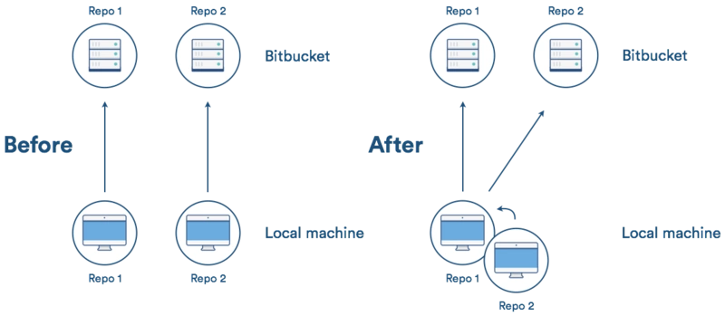

# git命令


## 基础命令


## git subtree

git subtree 可以实现一个仓库作为其他仓库的子仓库。



我们执行以下命令把libpng添加到photoshop中：
```
git subtree add --prefix=601_docs https://github.com/zhouxingkong/601_docs.git master --squash
```

如果源libpng仓库更新了，photoshop里的libpng如何拉取更新？使用git subtree pull，例如：
```
git subtree pull --prefix=601_docs https://github.com/zhouxingkong/601_docs.git master --squash
```

如果在photoshop仓库里修改了libpng，然后想把这个修改推送到源libpng仓库呢？使用git subtree push，例如：
```
git subtree push --prefix=601_docs https://github.com/zhouxingkong/601_docs.git master
```
参考
+ https://segmentfault.com/a/1190000012002151
