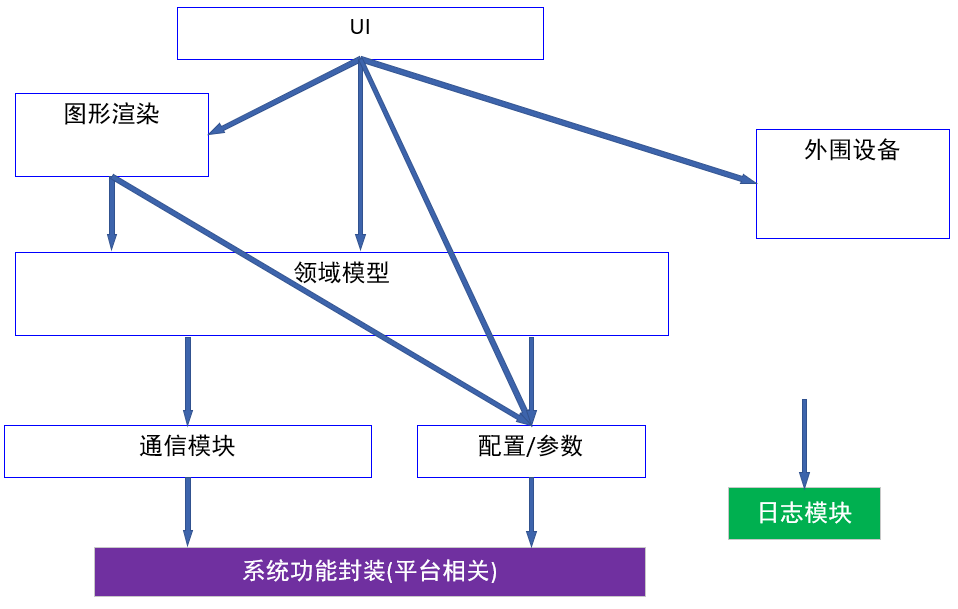
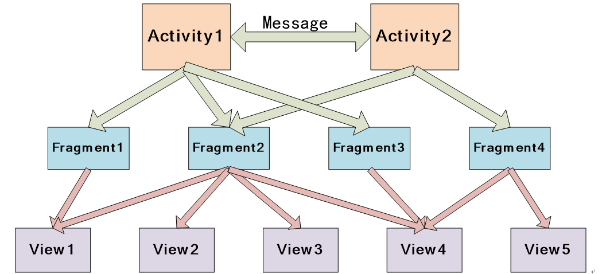
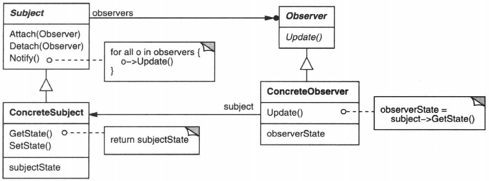
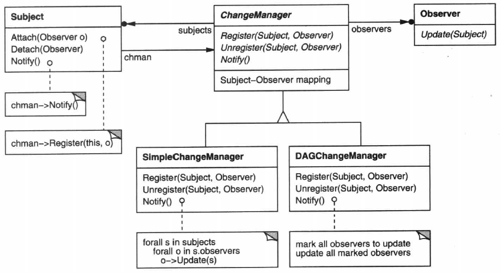
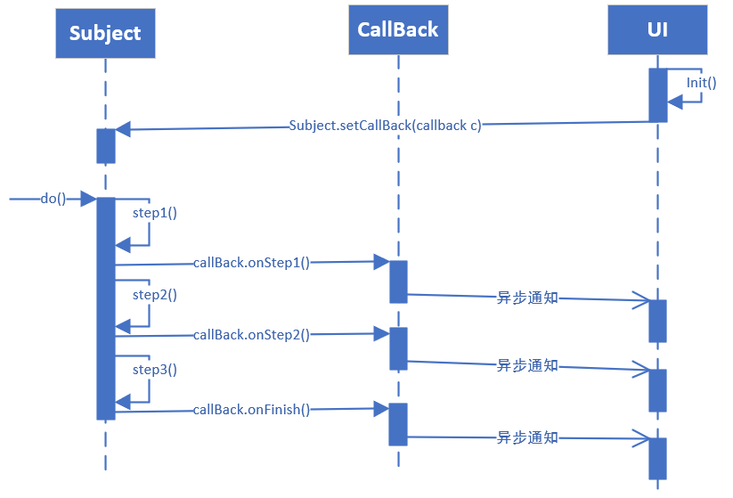
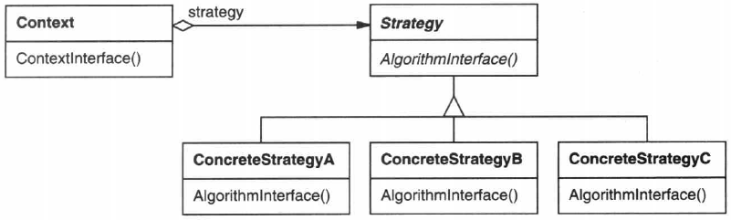
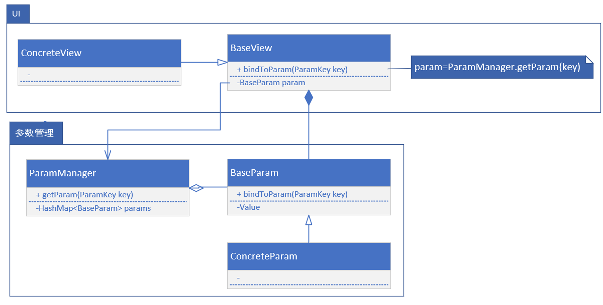

# 601软件架构

|修改日期|版本|负责人|
|--|--|--|
|2019.1.10|1.0|周星宇|  

本文旨在根据601实验室现有软件项目，设计出一个适应大多数工业检测设备的软件架构

## 1.模块划分


软件系统宏观分层架构如图所示。


总体上讲，所有模块可划分为三类
+ `领域相关模块`:封装了和领域相关的内容，如相控阵扫查、TOFD成像、呼吸机参数计算等等。该模块在不同领域间不能复用，如相控阵软件的校准流程不能用于呼吸机软件。
+ `领域无关模块`:领域无关模块封装了和领域无关的内容，如GPS、摄像头、USB通信、网络通信、参数管理框架。不同软件如需复用这部分功能只需包含该模块即可，不需要修改模块内部代码。
+ `平台相关功能`:平台相关的模块封装了不同操作系统中有差异的程序。如:Linux系统中使用ioctl机制访问USB设备而windows系统则不同。将平台相关的程序进行单独封装有利于对程序进行跨平台移植。

#### 模块的编程实现
图中蓝色方框代表大模块(例如图形渲染，领域模型，外围设备...)。每个大模块根据职责划分还会包含很多的小型模块，每个小模块包含很多各司其职的类。对于编译器来讲，模块的编译应具有独立性。模块可单独进行编译生成动态链接库，这保证了一些简单功能的添加和修改不会使整个系统重新编译。对于git版本控制器来说，不同模块可单独进行版本管理也可共同进行管理。
+ 对于Android系统来说，每个模块代表一个module,拥有独立的gradle编译脚本或CmakeList.txt脚本
+ 对于windows系统来说，每个模块代表一个dll
+ 对于linux系统来说，每个模块代表一个so

之所以将不同模块作为动态链接库的方式物理分离而不仅仅是使用包名进行逻辑分离，是为了方便对模块间的依赖进行约束。使用逻辑分离的方式，模块间很容易的实现双向依赖，给后期维护添加了麻烦。

### 1.1 模块介绍

+ `UI模块`-该模块为程序最顶层的模块。用来处理UI的绘制以及MVC模式组件之间的协调(view刷新机制)。
+ `领域模型`-绝大部分领域核心操作都封装在领域模型。该模块可根据功能进一步划分成子模块，如配置解析、数据处理、参数校准等等。
+ `图形渲染模块`-之所以将此模块和UI分开，是为了实现性能消耗较大的循环刷新显示需求。在此模块中统一对图形渲染进行优化(使用GPU)。  
大部分情况下图形渲染方式因领域而异，所以此模块属于领域相关模块。但是如果软件中图形渲染方式复杂、种类繁多、预计代码量庞大的话，可考虑在渲流程中抽象出领域无关的操作进行单独封装。
+ `参数/配置模块`-该模块负责对应用于整个系统的配置参数进行管理。这里的配置参数既可以是领域相关的，如信号放大倍数、信号建波方式，也可以是领域无关的，如屏幕亮度、声音大小。  
值得注意的是，为了实现参数/配置模块的可复用性，保证此模块的领域无关性至关重要。这就需要明确的界定此模块的责任。一般情况下参数/配置模块只提供管理参数所需的框架，但是具体管理的参数要在领域模型模块中进行注册。
+ `通信模块`-指的是系统上下位机主要数据交互的信道的控制模块。通信模块通常来说并不需要直接和设备进行交互，而是以系统调用的方式来使用操作系统提供的IO资源。
+ `外围设备`-控制和系统其它模块没有耦合的设备。注意:系统主要数据来源的设备不能算作外围设备。例如:相控阵软件中传递扫查数据的USB设备，呼吸机软件中传递系统参数的串口设备。  
外围设备的设计要遵循可插拔的思想，最好将代码单独编译成.jar/.dll/.so链接到系统中，从而减少软件维护人员的可见代码量。

### 1.2 模块间的依赖关系

为了减小模块间的耦合度，需要对模块间的关系进行规定。
+ `单向耦合原则`:模块间应只维持最基本的耦合，且只能维持单向的耦合，即上层模块可依赖下层模块，下层模块不应依赖于上层模块
+ `库包含原则`:以库的包含关系来讲，在上层模块dll中加载下层模块dll。反之不可。

注意:单向耦合原则的含义不只是下层模块不能引用上层模块的类和调用上层模块的方法。而是`信息耦合`，下层模块不能知道上层模块职责的存在。举个例子:不能在领域模型定义和界面绘制有关的变量，因为领域模型不知道UI的存在。

下图展示了模块间的典型依赖关系。其中箭头从依赖模块指向被依赖的模块



绿色的模块代表了软件的通用基础设施，该类模块被软件中所有其他模块调用。例如日志模块，在调试版软件中，任何模块的运行过程中都需要加载日志模块来打印运行期日志。在发布版软件中应关闭调试日志的打印。

理想状况下模块只有单向的依赖关系，但是现实总是事与愿违，下面一节介绍模块间反向依赖的处理方法。

### 1.3 处理模块的反向耦合--回调法

在程序中使用分层架构时经常遇到下层模块需要调用上层模块逻辑的情况。例如:领域模型中一些业务流程执行结束后需要UI层刷新界面显示。如果以函数调用的方式直接调用的话就违反了模块间只能单向耦合的规则。

回调法可以用来解决此问题。回调法的思想源自于Command模式(《设计模式》第5.2节)。回调法的UML类图如下图所示：


回调方法实现起来相当简单，只需要
1. 底层模块定义CallBack接口，但是不提供具体实现，因为具体实现可能需要引用上层模块的内容。例如刷新界面显示。
2. 在上层模块提供CallBack的具体实现CallBackImpl，并以@Override或给函数指针赋值的方式定义其中方法的具体实现。
3. 在整个系统初始化时，Client将CallBackImpl实例对象注册到下层的领域对象中。
4. 下层模块在处理领域逻辑时就可以使用回调接口通知上层模块了。

通过下面的时序图可以很容易的理解上述流程


回调方法有如下的优点
+ 将接口与实现相分离，分离的设计有助于代码的维护工作。如果需要修改领域模型生命周期执行的事件，只需要修改顶层模块中的实现部分，不需要修改底层模块。  
这也第1章开头部分将参数和配置文件管理模块作为平台无关模块进行划分的原因。参数管理模块只提供了参数的增删改查以及持久化的框架，具体需要实现什么参数由领域模型来注册。
+ 如果两个模块的程序在不同线程中执行的话，回调方法可起到异步通知工作进度的作用。


#### 并发中的回调

有时领域模型在独立线程中执行，而回调函数中刷新UI显示的功能必须在UI线程中执行(Android系统限制)。这种情况下需要使用进程间通信机制将时间通知到UI线程。

最简单的方法是共享内存法。说白了就是设置一个全局信号变量，UI线程轮询检查该变量的状态，当该变量置位则刷新UI显示。

进程间通信的方式根据平台而定，如果是Android系统则推荐使用Looper-Handler-Message机制。

#### 系统中的反向耦合

下图总结了本文提出架构中存在的模块间反向耦合。这里出现的耦合全都可以用回调方法来解决。


1. 图形渲染模块工作在独立的渲染线程中，渲染线程的工作状态通过回调的方式通知UI线程
2. 领域逻辑执行结束或领域模型改变后通过回调的方式通知UI刷新。注意此处领域逻辑不一定非要执行结束才能通知，在领域逻辑生命周期的任何时刻都能按照需求进行通知，从而实现更加灵活的异步通知。(参考后文对生命周期的介绍)
3. 本文将配置/参数模块划分为领域无关模块，而该模块中管理的参数大部分都是领域相关的。所以需要在领域模型中定义参数的行为，并使用回调方法注册到配置/参数模块中。

### 1.4 模块对外接口

实际设计中不应该将模块中的每个类都对外暴露供其他模块来引用。所以本文提倡的方法是使用`外观模式`来暴露对上层模块的接口。

将一个系统划分成为若干个子系统有利于降低系统的复杂性。一个常见的设计目标是使子系统间的通信和相互依赖关系达到最小。达到该目标的途径之一是就是引入一个外观（facade）对象，它为子系统中较一般的设施提供了一个单一而简单的界面。


为了保证全局一致性，Facade类最好使用单例模式来实现。

>此模式比较简单，所以不加赘述。参考《设计模式》4.5节

## 2.界面

### 2.1 MVC架构实现UI

程序规模较小时当然也可以把所有功能都放在UI模块来执行，但是随着软件复杂度的增加，可能会出现不同软件操作要执行同一领域逻辑的需求。例如修改放大器增益参数既可以通过三级菜单修改，也可以通过快捷菜单直接修改。这种情况下不可能把领域逻辑写两遍放到两个控件的响应函数里。更加科学的做法是将不同职责分由不同组件进行处理。这就是MVC模式的设计思想，该模式分为三个组件:

+ `模型组件`封装了核心数据和功能，独立于输出的表示方式和输入行为。
+ `视图组件`向用户显示信息并从模型中获取数据。同一个模型可以有多个不同的视图。
+ 每个视图都有相关联的`控制器组件`。控制器接收输入，这通常是表示鼠标移动、单击鼠标按钮或键盘输入的事件。事件被转换为向模型或视图发出的服务请求。用户只通过控制器与系统交互。


模型组件包含应用程序的功能核心，它封装了合适的数据，并暴露了执行应用程序特定处理的过程，而控制器代表用户调用这些过程。模型还提供了用于访问其数据的函数，供视图组件获取要显示的数据。

变更传播机制在模型中维护了一个注册表，其中列出了依赖于模型的组件。所有视图及部分控制器都通过注册指出发生哪些变化时应通知它们。模型的状态发生变化时，将触发变更传播机制。变更传播机制是模型与视图和控制器联系的唯一渠道。

每个视图都定义了一个更新过程，该过程由变更传播机制激活。更新过程被调用时，视图从模型获取要显示的最新数据，并显示到屏幕上。

>注:对MVC架构的详细描述见《面向模式的软件架构1》2.4.1节。

### 2.2 基于View树的界面布局

本节介绍MVC架构中的View部分实现。大多数UI框架中使用控件的概念来集成View和Control两个部分的功能。所以本节中提到的View实际上等于VC。

因为UI界面的实现因平台而异。这里以Android系统为例，其他系统大同小异。

Android平台界面使用三层View树的形式进行组织。层次之间是复合的关系。
+ Activity:代表一个完整的界面。
+ Fragment:代表完整界面中的一个区域。使用Fragment来定义界面中一块特定的区域可实现在不同的界面中复用该区域。  
例如:相控阵探伤软件中，扫查和向导两个界面中都需要显示二级菜单和三级菜单。所以将二级菜单和三级菜单定义为Fragment可实现在多个界面中复用同一区域的界面布局。
+ View:具体控件，如按钮、编辑框等等.


这种树形界面组织类似于composite模式。但也和composite模式不同。有兴趣的话可以参考《设计模式》4.3节内容。

#### View树形结构

上面的UML类图并不能看出View的树形结构，也不能体现一个Fragment实例被不同的Activity所复用。下面的这张示意图展现了View对象的宏观结构。



#### view刷新显示
View树节点最重要的方法是refreshView()，作用是刷新该节点及其子节点的界面。该方法在基类中定义，在子类中覆盖实现。当refreshView()被调用，他会递归遍历以他为根的所有子节点调用refreshView()方法，从而实现整个区域的刷新的通知。

如果用户希望实现更加灵活的刷新方式(例如只刷新部分子节点的显示)，可以考虑使用`Chain Of Responsibility`(责任链)模式。

#### View模块的职责

虽然这里可能是废话，但是还是要强调一下。View模块的职责只是界面的绘制，不要将任何业务逻辑放到view模块中，除非确信该逻辑只有这一处调用，不会被其他模块或界面中的其他元素调用。

### 2.3 View更新控制

在MVC架构中，View显示的内容来源于Module。当Module改变时，所有和该Module相关的View也应该进行刷新。

最简单的View刷新方式是定时刷新，不管Module层是否变化，每到一定时间View层自动刷新。由于实时刷新对系统资源的消耗，这种方案一般只用于Module中数据实时变化的情况。


Observer(观察者)模式可解决非实时的View刷新问题。Observer模式描述了如何建立View和Module间的数据同步关系。这一模式中的关键对象是目标( subject)和观察者(observer)。一个目标可以有任意数目的依赖它的观察者。一旦目标的状态发生改变, 所有的观察者都得到通知。作为对这个通知的响应，每个观察者都将查询目标以使其状态与目标的状态同步。



>参考《设计模式》5.7节

#### 处理复杂依赖关系

当目标和观察者间的依赖关系特别复杂时, 可能需要一个维护这些关系的对象。我们称这样的对象为更改管理器（ChangeManager）。它的目的是尽量减少观察者反映其目标的状态变化所需的工作量。例如, 如果一个操作涉及到对几个相互依赖的目标进行改动, 就必须保证仅在所有的目标都已更改完毕后，才一次性地通知它们的观察者,而不是每个目标都通知观察者。

ChangeManager有三个责任:
+ 它将一个目标映射到它的观察者并提供一个接口来维护这个映射。这就不需要由目标来维护对其观察者的引用, 反之亦然。
+ 它定义一个特定的更新策略。
+ 根据一个目标的请求, 它更新所有依赖于这个目标的观察者。



## 3.领域模型

### 3.1 设计方法:管理生命周期

生命周期表示每条业务逻辑的完整执行流程，包括开始-->step1-->step2-->......-->完成。笔者认为，每条或大或小的业务逻辑都应该被划分为不同步骤并定义该步骤完成后的回调接口。实现该回调接口的对象(一般都是上层模块的调用者)就相当于订阅了这些回调事件。
当业务逻辑的每个步骤执行完成应当通过回调的形式通知上层模块的调用者。

下面这段简单的代码展示了生命周期接口的大致结构。
``` java
public interface LifeCicle {
	public void onStep1();//步骤1
  public void onStep2();//步骤2
	public void onFinish();//完成
  public void onFail();//失败
}
```

注意:业务逻辑所处的模块只负责定义该接口，不提供实现。而对该事件感兴趣的上层模块要提供接口的实现并注册到业务逻辑的处理类中。流程图类似于1.3节描述的回调法，如下图所示



生命周期模型使用回调方法来实现线程间异步通知的功能，可解决不同线程的同步问题(UI线程的界面刷新和业务逻辑线程)，避免在不同线程之间出现竞争等的时序问题

本节应当结合`1.3 处理模块的反向耦合–回调法`节来理解。1.3节介绍了回调方法的架构，本节介绍了将业务逻辑划分为不同生命周期的编程思想，而生命周期的异步通知方式即为回调法。

#### 使用实例

生命周期的概念在本文提出的架构中无处不在。只要涉及到执行一个特定流程的情况都需要用到生命周期。这里只是例举一些生命周期的典型用法。
+ 通信流程:计算配置参数-->生成通信协议-->下发通信协议-->等待应答-->确认应答
+ 修改参数流程:检查参数是否合法(上下界)-->设置参数值-->处理和其他参数的依赖关系-->(如果需要)配置到下位机-->(如果需要)刷新UI显示
+ 图形渲染:屏幕坐标是否改变-->获取渲染纹理数据-->绘制图形
+ 设备连接:USB设备插入-->USB数据到来-->USB拔出


### 3.3 设计原则:避免出现过长方法

在以往的程序开发中，经常会出现一个文件内包含过长或过多的方法的情况。这类方法有两个特点
+ 使用switch或大量的if/else结构来针对不同情况进行不同操作。例如在屏幕中显示一个扇形的程序需要根据扇形角度范围来改变显示的位置。
+ 将很多处理不同情况的函数放在一个文件中。

这样搞会降低代码的可读性和可维护性。时间长了想要可能自己都要看半天才能理解当初的设计思想。

可以使用`Strategy模式`(策略模式)和`Template Method模式`(魔板方法模式)来解决此类问题。  

下图为strategy模式的框图


两个模式比较简单，在此不加赘述，请参考《设计模式》第5.9和5.10节。

另外需要指出的是，使用继承的方式实现算法流程的多态性还要注意对Liskov替换原则(见本文附录)的遵守。


## 4 参数管理

601实验室很多软件将领域逻辑和参数管理都写在UI模块中，这种方法的优点是程序比较直观，但是随着程序规模的增大，就会体现出这种方法的弊病，可扩展性可维护性较差，无法处理复杂的领域逻辑。

随着某些模块不断膨胀，要想让软件继续保持架构上的灵活性，就需要以重构原则来指导你的设计

>事不过三，三则重构

这句话的意思是:第一次做某件事时只管去做；第二次做类似的事会产生反感，但无论如何还是可以去做；第三次在做类似的是，你就应该重构。也就是说，任何功能的设计，只要让你感觉修改起来复杂，就需要进行重构。(参考《重构-改善既有代码的设计》)

当程序中多出出现同样或类似的逻辑时，应考虑对程序进行重构。提取出共有信息将其单独封装。一般情况下同类的逻辑出现三次就要考虑重构。

### 4.1 UI与参数

以相控阵探伤程序中需要管理不少于100个参数，每个参数都需要在菜单中可编辑，且可能不止有一种编辑方式。这就涉及到100多处编辑参数的逻辑。这违反了重构原则。

解决思路:

1. 将管理这100个参数的菜单对象进行抽象，提取出显示和编辑参数的功能封装到基类中。于是所有从该基类派生登的菜单对象都继承了显示和编辑参数的功能。不需要讲这些逻辑写100遍。
2. 将参数管理功能独立封装，与UI绘制逻辑相互分离。UI和参数管理类进行交互即可实现显示或修改参数的功能。这样的设计进一步降低了耦合度。
3. 对参数也使用抽象的方法，不同种类的参数(float,int,bool)都继承自同一基类。这样UI模块可将所有类型参数都当成同一种类型来对待，并通过封装的类型码实现多态的操作。
4. 参数管理类可使用统一的数据结构(Hash map)来管理这些参数。并设置参数的Key，任何UI对象都可以通过Key来获取并修改参数。




经过了这样的修改，UI模块的100个菜单中只需要一句话就能实现参数的一切操作。
``` java
view.bindToParam(ParamKey key);
```

### 4.2 领域模型与参数

按照上面讲的对参数管理功能进行单独封装后，由于100个参数的内容是领域相关的，所以参数管理模块也属于领域模型的一部分。考虑到随着参数数量的增多，参数管理模块的代码量也会随之增多，对该模块的维护会逐渐变得复杂。软件中最常修改的就是领域相关的内容，所以可以考虑对参数管理模块进行重构。

这次的重构目标是实现领域相关逻辑和领域无关逻辑的分离。
+ 关于如何管理参数值以及参数生命周期的统一方法是`领域无关`的。这部分功能独立于具体参数而存在，任何软件如果需要对参数进行管理，都可以复用这部分功能。
+ 关于参数具体内容以及参数修改是对应的行为是`领域相关`的。例如超声相控阵探伤软件中的扫查角度范围这类的参数，别的仪器中就没有，所以不能在领域之间复用。

举个例子帮助理解:图书馆是领域无关的，它提供了对所有图书编号管理以及借书还书的统一执行方法。而具体的图书是领域相关的，我可以打造一个自然科学图书馆，也可以打造社会科学图书馆，这取决于将什么类型的书注册进去。

通过将参数管理中领域无关的内容进行抽离并封装。最终的软件架构图如下图所示。这个架构图不用详细的看，用到的时候再理解也行。


## 4.通信

此处通信特指上位机和下位机间的通信。

### 4.1 处理通信的并发

并发问题普遍存在于和通信有关的功能中
+ 大部分情况下，和下位机通信需要使用系统调用进行IO操作。而IO操作的进程对于主程序来说是不可控的，所以需要将通信逻辑使用独立的线程来运行。
+ 进行上下位机通信协议的计算通常是耗时操作，所以使用独立的线程进行计算也是必要的。

#### active object模式配置下位机

为了解决并发问题可使用active object模式。该模式是Command模式的一个衍生品。其主要思想是使用一个命令队列将对下位机的配置消息进行缓存。
+ 领域模型根据用户的需求生成一套下位机配置的数据结构(例如相控阵聚焦法则或呼吸机串口命令)，并将该数据结构放入队列中。
+ 通信模块轮询或定时的检测命令队列，当有可用命令时处理该命令的下发。

这样的设计将配置数据机构的生成和下发进行分离。一方面通信模块不关心数据机构的内容，只负责将其下发。另一方面，领域模型不需要关心如何下发，只需要生成数据结构并且接收下发成功或失败的回调信息即可。

### 4.2 流水线方式进行数据处理

本节介绍一种提高性能的数据处理方法

工业检测类设备通常具有如下特点
+ 采集数据实时上传。例如：相控阵探伤、呼吸机参数、心电数据
+ 数据量可能较大。例如相控阵数据
+ 处理流程可能复杂。例如相控阵数据

这时可利用数字逻辑中的流水线思想。将数据处理流程划分为若干个流程，将流程进行流水处理。

使用FIFO作为流水线间数据传递的介质，避免因流水线中某一级处理速度慢导致数据丢失。

下面这张图以相控阵检测程序为例展示了流水线模式在高负荷数据处理中的应用


## 附录:面向对象设计的原则

+ `SRP 单一职责原则`
就一个类而言，应该仅有一个引起它变化的原因。
+ `OCP 开放一封闭原则`
软件实体(类、模块、函数等)应该是可以扩展的，但是不可修改。
+ `LSP Liskov 替换原则`
子类型必须能够替换掉它们的基类型。
+ `DIP 依赖倒置原则`
抽象不应该依赖于细节。细节应该依赖于抽象。
+ `ISP 接口隔离原则`
不应该强迫客户依赖于它们不用的方法。接口属于客户，不属于它所在的类层次结构。
+ `REP 重用发布等价原则`
重用的粒度就是发布的粒度。
+ `CCP 共同封闭原则`
包中的所有类对于同一类性质的变化应该是共同封闭的。一个变化若对一个包产生影响，则将对该包中的所有类产生影响，而对于其他的包不造成任何影响。
+ `CRP 共同重用原则`
一个包中的所有类应该是共同重用的。如果重用了包中的一个类，那么就要重用包中的所有类。
+ `ADP 无环依赖原则`
在包的依赖关系图中不允许存在环。
+ `SDP 稳定依赖原则`
朝着稳定的方向进行依赖。
+ `SAP 稳定抽象原则`
包的抽象程度应该和其稳定程度一致。

### 单一职责原则

>就一个类而言，应该仅有一个引起它变化的原因。

在SRP 中，我们把`职责`定义为"变化的原因" (a reason for change) 。如果你能够想到多于一个的动机去改变一个类，那么这个类就具有多于一个的职责。

为何要把这两个职责分离到单独的类中呢?因为每一个职责都是变化的一个轴线。当需求变化时，该变化会反映为类的职责的变化。如果一个类承担了多于一个的职责，那么引起它变化的原因就会有多个。

如果一个类承担的职责过多，就等于把这些职责藕合在了一起。一个职责的变化可能会削弱或者抑制这个类完成其他职责的能力。这种棉合会导致脆弱的设计，当变化发生时，设计会遭受到意想不到的破坏。

### 开放-封闭原则

> 软件实体(类、模块、函数等等)应该是可以扩展的，但是不可修改的。

遵循开放一封闭原则设计出的模块具有两个主要的特征。它们是:
1. "对于扩展是开放的" (Open for extension )。这意味着模块的行为是可以扩展的。当应用的需求改变时，我们可以对模块进行扩展，使其具杳满足那些改变的新行为。换句话说，我们可以改变模块的功能。
2. "对于更改是封闭的"(Closed for modificaiton)。对模块行为进行扩展时，不必改动模块的源代码或者二连制代码。模块的二进制可执行版本，无论是可链接的库、DLL 或者Java 的.jar 文件，都无需改动。

## 参考文件

+ 《设计模式》
+ 《敏捷软件开发》
+ 《面向模式的软件架构1》
+ 《重构-改善既有代码的设计》
